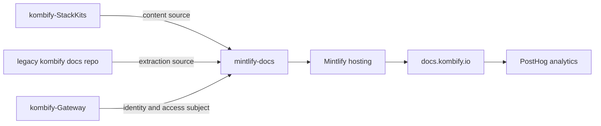

# mintlify-docs

[](STATUS.md)

This repository is the canonical public documentation and API reference surface
for kombify. It is built with Mintlify, configured entirely by `docs.json`, and
published at `https://docs.kombify.io`. It is the extraction target of the older
kombify documentation repository: content moves here, not the other way around,
and this repository is the successor for anything a reader can reach without
signing in.

> Local testing standard: run `mise run local:e2e` before any publication. The
> gate is described under [Local Gate](#local-gate).

## Scope

This repository owns:

- every publicly readable kombify documentation page, as MDX;
- `docs.json`, which is both the Mintlify navigation and the public-content
  allowlist;
- the public-safety policy that keeps non-public material out of the published
  site;
- the local and CI gates that prove the published surface before release.

This repository does not own:

- product architecture, standards, or internal runbooks — those stay in the
  owning product repositories and the workspace root;
- repo-local implementation documentation, which stays in each product repo's
  `docs/` folder;
- the systems it documents; pages are written against verified product-repo
  sources, never invented here.

## Publication Boundary

This repository is public-only documentation. `docs.json` is the allowlist:

- every `.mdx` file must appear in its navigation;
- hidden, draft, restricted, organization-member, group-gated, `internal/`,
  `operations/`, `review/`, and `runbooks/` content is rejected;
- operator secret names, internal secret-store paths, private provider origins,
  and credential-shaped values are rejected before preview;
- a page that is not ready for anonymous readers stays outside this repository
  until it is sanitized and publishable.

Mintlify authentication or navigation hiding cannot turn a directly reachable
file into acceptable public content. The exact-head CI preview verifies that
forbidden routes are absent from direct URLs, `llms.txt`, and the sitemap.

## Current Surface

`docs.json` currently defines four navigation tabs:

| Tab | Content |
| --- | --- |
| Guides | Landing page at `index.mdx`. |
| Identity & Access | `identity/overview`, `identity/architecture`, `identity/trust-and-security`. |
| Changelog | `changelog/overview`. |
| StackKits | Overview, quickstart, kits, how-to and use-case guides, per-service guides, explanations, and reference. |

## Runtime And Stack

| Concern | Choice |
| --- | --- |
| Site framework | Mintlify, configured by `docs.json` |
| Content format | MDX, committed in this repository |
| Toolchain | `mise` with Node 24; pinned `mint@4.2.684` via `npx` |
| Validation | PowerShell gates in `scripts/`, policy in `public-safety-policy.json` |
| Reader authentication | none; the site is anonymous by design |
| Delivery | Mintlify hosting at `docs.kombify.io` |
| Analytics | PostHog, configured in `docs.json` (`e.kombify.io`, session recording off) |

There are no code dependencies — no `go.mod`, no `package.json`. The real
dependencies are editorial and delivery ones: StackKits pages are written and
verified against the `kombify-StackKits` repository, the legacy kombify docs
repository is the upstream extraction source, Mintlify hosts the published site,
and PostHog receives page analytics.

Current verified dependency state: [STATUS.md](STATUS.md).

## Repository Context

<!-- generated: repo-context v2026-07-19; source: PLATFORM-ARCHITECTURE-TARGET.md ownership map -->



## Quick Start

```powershell
mise install
mise run dev
```

`mise run dev` starts the repository-pinned Mintlify preview. Edit any `.mdx`
file, add it to `docs.json`, and re-run the checks below before opening a pull
request.

## Common Commands

| Command | Purpose |
| --- | --- |
| `mise run dev` | Local Mintlify preview on the pinned CLI version. |
| `mise run check` | Deterministic navigation, content-boundary, and local-link checks. |
| `mise run public-safety` | Assert the whole tree is public-safe. |
| `mise run public-safety:test` | Focused fail-closed publication-boundary tests. |
| `mise run local:e2e` | Full local gate, including the live preview. |
| `mise run links:advisory` | Non-blocking provider link advisory. |

`mise.toml` remains the authority for the task surface.

## Local Gate

```powershell
mise run local:e2e
```

The gate starts the pinned Mintlify runtime and proves both public and forbidden
routes over real HTTP. It must pass before publication.

The upstream `mint broken-links` command currently parses root repository
metadata such as `AGENTS.md` as MDX. It stays visible as
`mise run links:advisory` and is not the release gate until that provider
behaviour is fixed.

## Standards

This repository is governed by the kombify workspace standards, which live in
the workspace root and in `kombify-Core/standards/` rather than being copied
here:

- `DOCUMENTATION-STANDARD.md` — documentation tiers, ownership, and supersession.
- `REPO-FILE-SCHEMA.md` — required root files and their contracts.
- `LANGUAGE-LOCALIZATION-STANDARD.md` — English for technical documentation.
- `LOCAL-E2E-DEPLOYMENT-STANDARD.md` — the local gate before any publish.

Copying standard text into this repository is prohibited. Link to the owning
document instead.

## Documentation

| Document | Purpose |
| --- | --- |
| [STATUS.md](STATUS.md) | Current implementation state and verified dependencies. |
| [ROADMAP.md](ROADMAP.md) | Milestones and release gates. |
| [CONTRIBUTING.md](CONTRIBUTING.md) | Contribution workflow. |
| [AGENTS.md](AGENTS.md) / [CLAUDE.md](CLAUDE.md) | AI-agent instructions. |
| [docs.json](docs.json) | Navigation and public-content allowlist. |
| [public-safety-policy.json](public-safety-policy.json) | Fail-closed paths, patterns, and smoke routes. |
| [schemas/public-safety-policy.schema.json](schemas/public-safety-policy.schema.json) | Policy contract. |
| [identity/architecture.mdx](identity/architecture.mdx) | Published identity and access architecture, including current diagrams. |
| [openwiki/](openwiki/) | Generated agent documentation — non-authoritative. |

Generated agent documentation never overrides this README, `STATUS.md`, or the
workspace standards.

## Issue Tracking

```bash
bd ready
bd show <id>
bd update <id> --claim
bd close <id>
```
