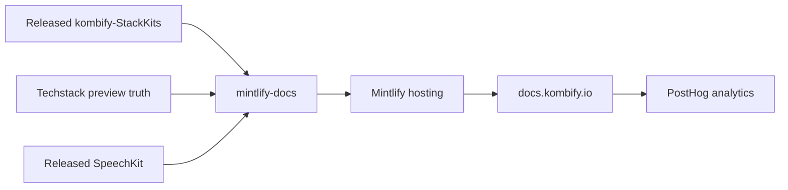

# mintlify-docs

[](STATUS.md)

This repository is the single source of truth for Kombify's anonymous public
documentation at `https://docs.kombify.io`. Its current scope is deliberately
narrow: released StackKits and SpeechKit capabilities, the truthful Techstack
preview contract, and the identity concept needed to use them safely.

## Public Scope

This repository owns the published MDX tree, Mintlify navigation, positive
publication allowlist, and the local and live gates for `docs.kombify.io`.

The public surface has five tabs:

| Tab | Content |
| --- | --- |
| Start | Product entry points and current availability. |
| StackKits | Released kits, modules, workflows, CLI, and MCP documentation. |
| Techstack | Preview product boundary, operating modes, and availability. |
| SpeechKit | Released Windows beta, voice modes, and Go framework guidance. |
| Identity & Access | The small identity boundary relevant to StackKits. |

Content for Cloud, Simulate, AI, Workbench, Companion, unreleased components,
internal infrastructure, comparisons, operator runbooks, and generic platform
architecture remains outside the current public scope. Simulate is not a
standalone product and must not appear as one.

## Publication Boundary

`public-safety-policy.json` is the explicit positive allowlist. A public page
must match an approved exact path or prefix, appear in `docs.json`, and pass the
forbidden-content checks. Navigation hiding and Mintlify authentication do not
make a directly reachable file safe to publish.

StackKits pages are accepted only when they describe the current public
StackKits release. Repository presence, draft metadata, preview status, or an
internal development workflow is not release evidence.

SpeechKit instructions are pinned to its exact public release and assets.
Techstack pages deliberately document the product contract and preview status
without presenting a public installer or source distribution that does not yet
exist.

The old Kombify documentation repository is not an upstream source and must
not be used for migration or content recovery. Product repositories and their
public release artifacts are the verification sources.

## Runtime And Dependencies

| Concern | Choice |
| --- | --- |
| Site | Mintlify configured by `docs.json` |
| Content | English MDX committed in this repository |
| Toolchain | `mise`, Node 24, pinned `mint@4.2.684` |
| Validation | PowerShell gates plus `public-safety-policy.json` |
| Delivery | Mintlify hosting at `docs.kombify.io` |
| Analytics | PostHog via `e.kombify.io`, session recording disabled |



## Local Workflow

```powershell
mise install
mise run check
mise run local:e2e
```

| Command | Purpose |
| --- | --- |
| `mise run dev` | Start the pinned local Mintlify preview. |
| `mise run check` | Validate the positive scope, navigation, content, and local links. |
| `mise run public-safety:test` | Run fail-closed policy regression tests. |
| `scripts/check-stackkits-release-truth.ps1` | Pin installer URLs and prevent known v0.16.0 wording regressions. |
| `scripts/check-stackkits-external-links.ps1` | Verify the bounded website, installer, and release destinations used by the StackKits quickstart. |
| `scripts/check-speechkit-release-truth.ps1` | Pin SpeechKit version, platform, module, and Windows assets to the public release. |
| `scripts/check-techstack-public-boundary.ps1` | Prevent synthetic Techstack installation or availability claims. |
| `scripts/check-product-docs-external-links.ps1` | Verify the public Techstack entry and SpeechKit release destinations. |
| `scripts/check-code-example-relevance.ps1` | Allow executable and structured examples only on pages with a topic-specific workflow or configuration. |
| `mise run local:e2e` | Prove allowed and forbidden routes over real local HTTP. |
| `mise run remote:public-safety` | Prove the deployed route and projection matrix. |
| `mise run delivery:wait-exact-live` | Wait for a successful `docs.kombify.io` deployment at exact `SOURCE_SHA`. |

The local gate runs `mint validate` and the repository-owned route checks. It
must pass before publication.

## Authority

- `docs.json` defines the Mintlify navigation.
- `public-safety-policy.json` defines the permitted public page scope and live
  smoke matrix.
- `kombify-StackKits` public release artifacts define released StackKits truth.
- `kombifyio/SpeechKit` public tag and release assets define SpeechKit truth.
- The active Techstack product authority defines its public contract; the docs
  keep distribution unavailable until a real public release exists.
- Workspace standards define documentation and delivery policy; they are not
  copied into public pages.

See [STATUS.md](STATUS.md), [ROADMAP.md](ROADMAP.md), and
[CONTRIBUTING.md](CONTRIBUTING.md) for current state and contribution rules.

## Issue Tracking

```bash
bd ready
bd show <id>
bd update <id> --claim
bd close <id>
```
