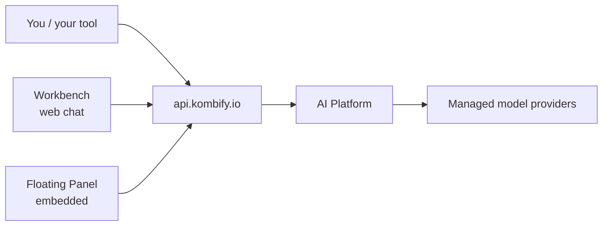

**kombify AI** is the hosted AI layer of the kombify platform. It gives you one authenticated API for AI capabilities, a web chat surface for working with them, and embeddable components for bringing the same AI into your own tools.

<Note>
  kombify AI is in **beta**. Features roll out per subscription plan; everything documented here describes surfaces that are deployed today.
</Note>

## The pieces

| Surface | What it is | Where |
| --- | --- | --- |
| **AI Platform API** | The single API for models, sessions, responses, structured generation, and knowledge queries | `api.kombify.io/v1/ai/*` |
| **Workbench** | Web chat for working with kombify AI — streaming threads, session history | [workbench.kombify.io](https://workbench.kombify.io) |
| **Floating Panel** | An embeddable AI panel that products (including kombify tools) integrate | Embedded in kombify tools |

## How it fits together

All AI traffic flows through the kombify API gateway with your kombify account (Auth0 sign-in) or an API token. The platform routes requests to managed model providers, tracks usage, and applies your plan's entitlements — you never handle provider keys for the hosted service.

Open-source kombify tools keep their own AI story: they work with **your own provider keys**, independent of the hosted platform — see [SpeechKit](/speechkit/overview) for an example. The hosted kombify AI adds convenience: managed providers, usage tracking, shared sessions, and platform integration.

## Get started

<CardGroup cols={3}>
  <Card title="Quickstart" icon="rocket" href="/ai/quickstart">
    Sign in and run your first AI session in the Workbench.
  </Card>
  <Card title="Workbench" icon="messages" href="/ai/workbench">
    The web chat surface.
  </Card>
  <Card title="API surface" icon="code" href="/ai/reference/api">
    Endpoints, auth, and models.
  </Card>
</CardGroup>
