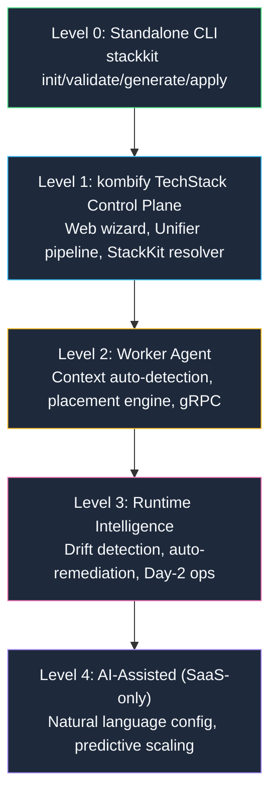

**StackKits** are architecture-pattern-based infrastructure blueprints built on three concepts: **StackKit** (pattern), **Node-Context** (environment), and **Add-Ons** (composable extensions).

<Card title="What's a StackKit?" icon="box">
  A StackKit defines an **architecture pattern** — how services relate to each other. Combined with auto-detected **Node-Context** and composable **Add-Ons**, it produces a fully validated, context-aware infrastructure configuration.
</Card>

## The problem StackKits solve

You want to set up a homelab. You've heard of:

<Columns cols={4}>
  <div>
    **Reverse Proxy**
    - Traefik?
    - Caddy?
    - nginx?
  </div>
  <div>
    **Authentication**
    - Authelia?
    - Authentik?
    - Keycloak?
  </div>
  <div>
    **Management**
    - Coolify?
    - Komodo?
    - Dockge?
  </div>
  <div>
    **Photos**
    - Immich?
    - Photoprism?
    - Nextcloud?
  </div>
</Columns>

**Questions:**
- Which tools work well together?
- How do I configure them correctly?
- What are the best practices?
- How do I avoid security mistakes?

**StackKits answer all of these.**

## The three concepts

### 1. StackKit = Architecture pattern

A StackKit defines **how infrastructure is organized**, not how many servers you need.

| StackKit | Pattern | What it means |
|----------|---------|--------------|
| **basement-kit** | Local single-environment | All services on your home network — one trust domain, any node count |
| **cloud-kit** | Cloud single-environment | The same node model on a VPS you bring — public ingress by default |
| **modern-homelab** | Hybrid infrastructure (Preview) | Local + cloud combined via the bridge contract, multi-node on both ends possible |

<Tip>
  A `basement-kit` can run on 3 Raspberry Pis or 1 powerful server. The StackKit defines the *pattern*, not the *scale*. Multi-node alone does not make a deployment a Modern Homelab — the bridge contract between local and cloud does.
</Tip>

<Note>
  **High Availability is an add-on, not a kit.** Layer the [`ha` add-on](/stackkits/addons/high-availability) onto any kit — `warm-standby` (2+ nodes) or `quorum` (3+ odd manager nodes). The node floors are technical prerequisites, never paywalls.
</Note>

### 2. Node-Context = auto-detected environment

| Context | How it's detected | What it affects |
|---------|-------------------|----------------|
| **local** | Physical hardware, no cloud metadata | Self-signed TLS, local DNS |
| **cloud** | Cloud provider metadata detected | Let's Encrypt, Coolify, public DNS |
| **pi** | ARM + low memory or RPi detection | ARM images, reduced services, tmpfs |

### 3. Add-Ons = composable extensions

Add-Ons replace the old monolithic variant system. They stack and compose:

```yaml stack-spec.yaml
stackkit: basement-kit
addons:
  - monitoring    # Metrics + Grafana
  - backup        # Encrypted backups
  - media         # Jellyfin + *arr
```

## Available StackKits

<CardGroup cols={3}>
  <Card title="Basement Kit" icon="house" href="/stackkits/kits/basement-kit">
    **Local single-environment**

    - Docker Compose
    - Any node count
    - Context-aware defaults
    - Perfect first homelab
  </Card>
  <Card title="Cloud Kit" icon="cloud" href="/stackkits/kits/cloud-kit">
    **Cloud single-environment**

    - BYO-VPS
    - Public ingress
    - Let's Encrypt
    - No hardware at home
  </Card>
  <Card title="Modern Homelab" icon="rocket" href="/stackkits/kits/modern-homelab">
    **Hybrid infrastructure (Preview)**

    - Local + cloud nodes
    - Bridge contract built-in
    - Public + private services
    - Early Access
  </Card>
</CardGroup>

## How StackKits work

### Context-driven defaults

The combination of StackKit × Context produces curated default configurations:

| | local | cloud | pi |
|---|---|---|---|
| **basement-kit** | Coolify, self-signed TLS | — | Lean profile, reduced services |
| **cloud-kit** | — | Coolify or Komodo, Let's Encrypt | — |
| **modern-homelab** | Preview | Preview | Preview |

### 3-Layer architecture

StackKits use a strict 3-layer architecture for maximum reusability:

| Layer | Purpose | Managed by |
|-------|---------|------------|
| **L1: Foundation** | System, security, packages, core identity | OpenTofu |
| **L2: Platform** | Container runtime, PAAS, ingress, platform identity | OpenTofu |
| **L3: Applications** | User services deployed by PAAS | PAAS (Coolify/Komodo) |

### CUE schema definition

Each StackKit is defined in [CUE](https://cuelang.org/), a powerful configuration language:

```cue basement-kit/stackfile.cue
package basement

import "github.com/kombihq/stackkits/basement"

#BasementKit: basement.#StackKit & {
    metadata: {
        name: "basement-kit"
        version: "4.0.0"
    }

    // Services with dependency constraints
    services: {
        traefik: #TraefikService
        coolify: #CoolifyService
        // ...
    }

    // Context-aware TLS selection
    if _context == "local" {
        tls: mode: "self-signed"
    }
}
```

<Tip>
  CUE provides type checking, validation, and default values — catching errors before deployment, not after.
</Tip>

### Validation flow

```mermaid
flowchart LR
    subgraph Input
        YAML["stack-spec.yaml"]
    end

    subgraph Resolution["CUE Resolution"]
        Kit["StackKit Pattern"]
        Ctx["Context Defaults"]
        AO["Add-On Merging"]
    end

    subgraph Validation
        V1["Schema checks"]
        V2["Constraint resolution"]
        V3["Dependency validation"]
    end

    subgraph Output
        Config["Validated Config"]
    end

    YAML --> Resolution
    Resolution --> Validation
    Validation --> Config

    style Input fill:#1e293b,stroke:#38bdf8,color:#f8fafc
    style Resolution fill:#1e293b,stroke:#f472b6,color:#f8fafc
    style Validation fill:#1e293b,stroke:#4ade80,color:#f8fafc
    style Output fill:#1e293b,stroke:#fbbf24,color:#f8fafc
```



## Progressive capability model

StackKits operates at different levels depending on how you use it:



## Example: basement-kit StackKit

### Minimal configuration

```yaml stack-spec.yaml
version: "2.0"
stackkit: basement-kit
domain: home.example.com

nodes:
  - name: server-01
    host: 192.168.1.100

# That's it! Traefik, Coolify, TinyAuth are auto-configured
# Context is auto-detected (local in this case)
```

### With Add-Ons

```yaml stack-spec.yaml
version: "2.0"
stackkit: basement-kit
domain: home.example.com

nodes:
  - name: server-01
    host: 192.168.1.100

addons:
  - monitoring       # Metrics + Grafana
  - backup           # Encrypted backups
  - media            # Jellyfin + *arr stack
```

## StackKit comparison

| Feature | basement-kit | cloud-kit | modern-homelab |
|---------|------|--------|-----|
| **Pattern** | Local single-environment | Cloud single-environment | Hybrid (Preview / Early Access) |
| **Contexts** | `local`, `pi` | `cloud` | ≥1 local + ≥1 cloud |
| **Typical nodes** | 1 (supports N) | 1 (supports N) | 2+ (multi-environment) |
| **Complexity** | Low | Low | Medium |
| **Failover** | Via the [`ha` add-on](/stackkits/addons/high-availability) | Via the [`ha` add-on](/stackkits/addons/high-availability) | Via the [`ha` add-on](/stackkits/addons/high-availability) |
| **Best for** | First homelab | Single VPS, public services | Hybrid setups |

## Customization

### Override defaults

```yaml stack-spec.yaml
stackkit: basement-kit

services:
  traefik:
    dashboard: true
  monitoring:
    retention: 30d
```

### Add-On ecosystem

| Add-On | Category | Compatible with |
|--------|----------|----------------|
| `monitoring` | Observability | all kits |
| `backup` | Data | all kits |
| `vpn-overlay` | Networking | modern-homelab |
| `ai-workloads` | Compute | basement-kit, modern-homelab |
| `media` | Applications | basement-kit, modern-homelab |
| `smart-home` | IoT | basement-kit |
| `ha` | Reliability | all kits (node floors apply) |

See the full catalog in [tool alternatives](/stackkits/reference/tool-alternatives).

## Next steps

<Columns cols={3}>
  <Card title="Basement Kit details" icon="house" href="/stackkits/kits/basement-kit">
    Explore services and configuration options
  </Card>
  <Card title="CUE basics" icon="code" href="/stackkits/explanations/cue-architecture">
    Learn the configuration language
  </Card>
  <Card title="Quick start" icon="rocket" href="/stackkits/quickstart">
    Deploy your first StackKit
  </Card>
</Columns>
