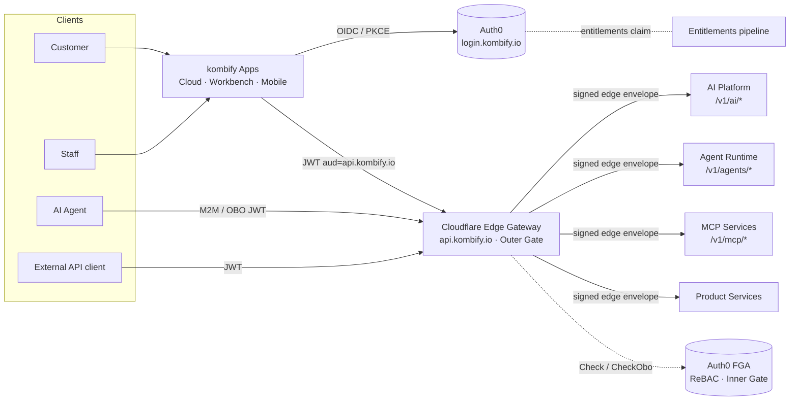
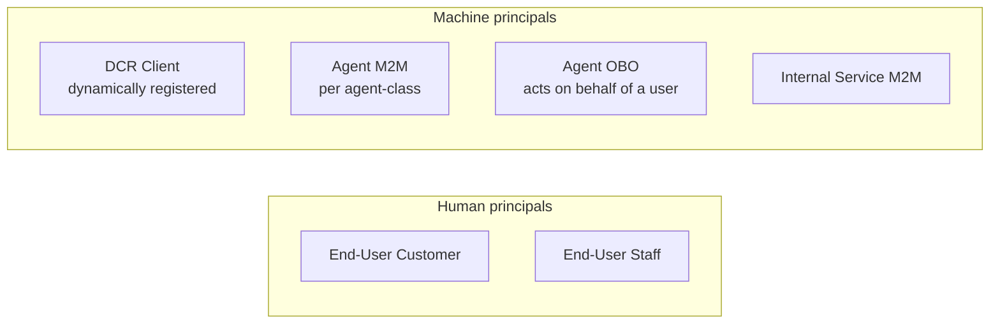
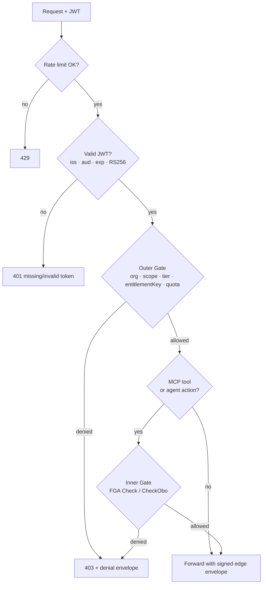
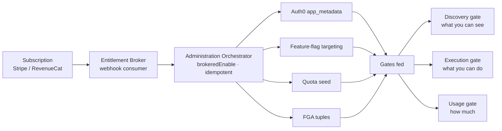

<Note>
Audience: engineers and integrators. This page describes the **architecture and
contracts**. For the simple version see [Explained Simply](/identity/overview);
for the strategy view see [Trust & Security](/identity/trust-and-security).
</Note>

<Warning>
**Production invariant:** Auth0 Universal Login at `login.kombify.io` is the
only interactive production provider and issuer. Cloud, Workbench, Companion,
Techstack, StackKits, Simulate, Central, and every future hosted application use
the same Kombify account and user directory. Per-application OAuth client
registrations are technical clients of this provider, not separate accounts or
login systems.
</Warning>

## Building blocks

kombify composes managed, best-in-class primitives rather than rolling its own crypto:

| Concern | Technology | Role |
| --- | --- | --- |
| **Authentication (AuthN)** | Auth0 — OIDC / OAuth 2.0, Universal Login | Who are you? Issues signed JWTs at `login.kombify.io`. |
| **Edge gateway** | Cloudflare Workers | Single front door `api.kombify.io`: routing, JWT verification, rate limiting, the outer policy gate. |
| **Authorization (AuthZ)** | Auth0 FGA (OpenFGA / ReBAC engine) | Fine-grained "can this principal do this to that resource?" for MCP tools and agent runtime. |
| **Entitlements / billing** | Stripe (web) · RevenueCat (mobile) | Source of truth for what a plan includes. |
| **Feature flags** | OpenFeature abstraction (Flagship primary) | Per-request, signed capability flags. |

## System context



Every external request enters through one edge. Internal services never trust the
caller directly — they trust a **signed edge envelope** the gateway adds after it has
authenticated and authorized the request. Unknown paths return `route_not_managed`
(deny-by-default routing).

## Identity classes

kombify recognizes six principal types. Keeping them distinct is what lets an agent
act *as* a user without ever exceeding that user.



| Class | Identity | Notes |
| --- | --- | --- |
| End-User Customer | Auth0 user | Plan/tier drives entitlements. |
| End-User Staff | Auth0 user | Staff roles are **orthogonal** to customer plans. |
| DCR Client | Dynamically registered OAuth client | For MCP connectors and third-party clients. |
| Agent M2M (per class) | Auth0 M2M, least-privilege | One client per agent class, `org_id` required. |
| Agent OBO | RFC 8693 token-exchange | Delegated JWT: `sub` = user, `act.sub` = agent class. |
| Internal Service M2M | Cross-boundary M2M | Internal service-to-service uses a signed service-call token, not Auth0 M2M, except across trust boundaries. |

**Organizations are mandatory.** Every principal carries an `org_id`, which anchors
tenant isolation and makes multi-tenant entitlements unambiguous.

## Login flow (OIDC + PKCE)

```mermaid
sequenceDiagram
  actor User
  participant App as kombify App
  participant Auth0 as Auth0 · login.kombify.io
  participant Edge as Edge Gateway · api.kombify.io
  User->>App: Open app
  App->>Auth0: Redirect to Universal Login (OIDC + PKCE + state)
  User->>Auth0: Authenticate (password / passkey / MFA)
  Auth0-->>App: Authorization code
  App->>Auth0: Exchange code + PKCE verifier
  Auth0-->>App: ID token + access token (RS256 JWT)
  Note over App: Tokens held in a server-side broker session;<br/>not exposed to the browser
  App->>Edge: Request + Bearer access token (aud = api.kombify.io)
  Edge->>Edge: Verify RS256 · issuer · audience · expiry
  Edge-->>App: Response
```

Key properties:

- **Universal Login only** — credentials are never collected by the application
  itself; the app redirects to the hosted login page.
- **PKCE + state** on every interactive flow.
- **Server-side token broker** — access/refresh tokens are kept server-side and not
  surfaced to client JavaScript.
- **Dual-issuer aware** — the edge accepts the primary issuer (`login.kombify.io`)
  with the underlying tenant as a JWKS/M2M fallback, avoiding a production
  split-brain during issuer migrations.

## The two-gate authorization model

Authorization is **defense in depth** and **fail-closed** at both layers.



### Outer gate — Cloudflare edge policy (always on)

Runs on every request at the edge:

- Verifies the JWT (RS256, issuer set, audience, expiry).
- Checks `org_id`, `scope`, plan **tier**, and the required **entitlementKey**.
- Applies per-request **signed capability flags** (so a stale flag cache can't grant
  access) and quota/rate limits.
- Strips any inbound identity headers and re-emits a **signed edge envelope** so
  origins can trust the caller's identity without re-validating the JWT.

### Inner gate — FGA Check / CheckObo (MCP tools & agents)

For MCP tool execution and agent runtime, a second check asks the ReBAC engine the
precise relationship question:

- `Check` — may this principal call this tool / read this resource?
- `CheckObo` — for delegated calls, the result is the **intersection** of the user's
  rights **and** the agent class's rights — never the union. Fail-closed on any error.

AI inference and knowledge/RAG routes (`/v1/ai/*`) are deliberately **outside** the
inner FGA gate: they are gated by tier + entitlement + quota at the outer gate. This
keeps the fine-grained authorization blast-radius focused on tools and agents.

## One vocabulary

A single dotted key is used end-to-end so the same concept never has two names:

```
lookup_key  ==  feature-flag key  ==  FGA relation key  ==  entitlementKey
e.g.  ai.tier.premium ,  mcp.knowledge.codebase.search
```

This is what lets a Stripe plan, a feature flag, an FGA relation, and an edge policy
decision all refer to the *same* capability.

## Entitlements pipeline

Subscriptions become enforceable capabilities through an idempotent, auditable broker
— a billing change never triggers a raw deploy.



Three gates are fed from the same grant:

- **Discovery** — which capabilities are even visible (relation + tier/flag).
- **Execution** — whether a specific call is allowed (FGA `Check`/`CheckObo`,
  endpoint/field-level).
- **Usage** — quota/budget counters and edge rate limits.

Destructive or high-risk operations can additionally require **human-in-the-loop**
approval (CIBA / step-up).

## Denial contract

A denial is never a bare "permission denied". The standard envelope carries:

- `error_code` and `reason_code`
- required vs. missing features (the `entitlementKey`s involved)
- retryability
- `user_guidance` — the concrete next step

This is what powers the friendly "what / why / what next" messages users see.

## Staged, reversible enforcement

Per-gate, per-domain, enforcement is rolled out in audited stages — each with a hard
exit criterion before promotion, and each reversible by flag:

```
Stage 0  Build       →  Stage 1  Keystones  →  Stage 2  Shadow-parity  →  Stage 3  Enforce
```

Shadow mode runs the real decision and **records** what it *would* have done without
affecting traffic; a gate only promotes to enforce once its shadow audit shows zero
false denials over real principals. The enforce order is **MCP tools → agents**;
knowledge/RAG stays tier-gated.

<Note>
The live, per-domain enforcement status (which gates are in shadow vs. enforce today)
is tracked internally and intentionally not published here.
</Note>

## Standards alignment

- **OIDC / OAuth 2.0** — Universal Login, authorization code + PKCE, client
  credentials.
- **RFC 8693** — token-exchange for on-behalf-of delegation.
- **RFC 9728** — protected-resource metadata for MCP OAuth discovery.
- **ReBAC** (relationship-based access control) via OpenFGA — self-hostable with an
  identical model for air-gapped deployments.
- **OpenFeature** — vendor-neutral feature-flag abstraction.
