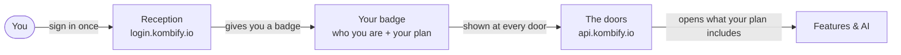

<Note>
This is the friendly, no-jargon version. For the engineering view see
[Architecture](/identity/architecture); for the strategy view see
[Trust & Security](/identity/trust-and-security).
</Note>

## The 30-second version

Think of kombify like a **secure office building**:

1. **Reception (Login).** You sign in once at the front desk — `login.kombify.io`.
   You prove who you are (password, passkey, or a second factor). Reception hands
   you a **badge**.
2. **The badge (Token).** Your badge says who you are and which **plan** you're on.
   It expires, so it can't be reused forever, and it's stamped so it can't be faked.
3. **The doors (Gateway).** Every room checks your badge at the door
   (`api.kombify.io`). No badge, no entry — the door stays shut by default.
4. **Floor access (Plan & permissions).** Your badge opens the doors your plan
   includes. Higher plans open more doors. Some special rooms do an extra check
   right at the door.

That's the whole idea: **sign in once, carry a tamper-proof badge, and every door
checks it.**

## What happens when you sign in

<Steps>
  <Step title="You open a kombify app">
    The Cloud dashboard, the Workbench, or the mobile app.
  </Step>
  <Step title="You're sent to reception">
    The app redirects you to the kombify login page. You never type your password
    into the app itself — only into the official login page. That's deliberate and
    safer.
  </Step>
  <Step title="You prove who you are">
    Password, passkey, or multi-factor. kombify uses a managed identity provider
    (Auth0) so this part follows the same rules banks and enterprises use.
  </Step>
  <Step title="You get your badge">
    The app receives a short-lived, signed token. It's kept safe on the server side,
    not left lying around in your browser.
  </Step>
  <Step title="You use the product">
    From now on the app quietly shows your badge at each door. You don't notice it —
    it just works.
  </Step>
</Steps>

## Why can't I use feature X?

Because your **plan** decides which doors open. When something is not included, you
won't get a confusing dead-end. You get a clear message that says:

- **what** you tried to do,
- **why** it's not available (which plan or feature is needed), and
- **what to do next** (e.g. "upgrade to unlock this").

We treat a "no" as a helpful signpost, not a wall.

## The three kinds of "you"

kombify keeps these clearly separate:

| Who | Example | What they can do |
| --- | --- | --- |
| **A customer** | You, using the product | Whatever your plan includes |
| **A staff member** | A kombify team member | Operational tools, kept separate from customer plans |
| **An AI agent acting for you** | An assistant doing a task on your behalf | Only what *you* are allowed to do — never more |

That last one matters: when an AI agent does something for you, it inherits **your**
permissions and nothing extra. It can't quietly do more than you could yourself.

## Good to know

<CardGroup cols={2}>
  <Card title="One sign-in" icon="key">
    Sign in once; the same identity works across kombify products.
  </Card>
  <Card title="Closed by default" icon="lock">
    If anything is unclear or a token is missing, the answer is "no". Safety first.
  </Card>
  <Card title="Short-lived badges" icon="clock">
    Tokens expire, so a leaked one stops working quickly.
  </Card>
  <Card title="Clear denials" icon="circle-info">
    Every "not available" comes with the reason and the next step.
  </Card>
</CardGroup>

<Note>
Want the details? Continue to the
[technical architecture](/identity/architecture).
</Note>
