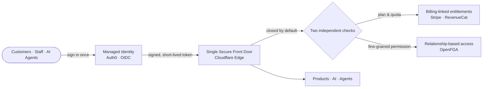

<Note>
Audience: stakeholders, partners, and investors. This page explains *why* the
architecture matters and where it stands. For the engineering detail see
[Architecture](/identity/architecture).
</Note>

## Why identity is foundational

For a platform that runs AI, hosts customer workloads, and bills by usage, **identity
and entitlements are not a feature — they are the control plane for trust and cost.**
Three things depend on getting them right:

- **Trust** — customers and enterprises only adopt what they can safely give access to.
- **Cost control** — every AI call costs money; access must map precisely to what a
  customer has paid for.
- **Scale** — onboarding many users safely requires that "who can do what, and how
  much" is enforced by the system, not by hope.

kombify treats this as core infrastructure, built on the same standards used by banks
and large SaaS providers.

## The model in one picture

**Sign in once. Carry a tamper-proof, expiring token. Every door is closed by default
and opens only what the customer's plan and permissions allow.**

## What makes it strong

<CardGroup cols={2}>
  <Card title="Managed, best-in-class" icon="award">
    Auth0 for identity, OpenFGA for fine-grained authorization, Cloudflare at the
    edge, Stripe for billing. We integrate proven systems instead of inventing our own.
  </Card>
  <Card title="Defense in depth" icon="layer-group">
    Two independent authorization gates. A miss at one layer is caught by the next.
  </Card>
  <Card title="Fail-closed by default" icon="lock">
    When anything is uncertain, access is denied. Safety is the default state, not an
    add-on.
  </Card>
  <Card title="Cost is gated, not hoped" icon="gauge-high">
    Paid AI usage is tied to entitlements and quotas, protecting margin as usage grows.
  </Card>
  <Card title="Agents stay in their lane" icon="robot">
    An AI agent acting for a user inherits exactly that user's rights — never more.
    Delegation is standards-based (RFC 8693).
  </Card>
  <Card title="Self-hostable" icon="server">
    The same authorization model runs self-hosted for enterprise and air-gapped
    deployments — no second, weaker code path.
  </Card>
</CardGroup>

## Built on open standards

| Capability | Standard |
| --- | --- |
| Login & single sign-on | OpenID Connect / OAuth 2.0, Universal Login, PKCE |
| Delegated "agent acts for user" | OAuth 2.0 Token Exchange (RFC 8693) |
| Fine-grained permissions | Relationship-based access control (ReBAC / OpenFGA) |
| Capability flags | OpenFeature (vendor-neutral) |
| Connector discovery | Protected-resource metadata (RFC 9728) |

Standards alignment means lower integration friction for partners, credible answers
in enterprise security reviews, and no lock-in to a single vendor.

## Where it stands today

We are transparent about maturity because a credible security story is an honest one.

<CardGroup cols={3}>
  <Card title="Authentication" icon="circle-check">
    **Live & enforcing.** Sign-in works across products; the edge rejects
    unauthenticated and invalid requests in production today.
  </Card>
  <Card title="Authorization & entitlements" icon="circle-half-stroke">
    **Provisioned, in staged rollout.** The fine-grained engine and the billing-linked
    entitlement pipeline are built and being promoted from audited shadow mode to full
    enforcement, gate by gate.
  </Card>
  <Card title="Public beta" icon="rocket">
    **Controlled, deliberate.** A limited, well-defined surface goes first, behind the
    enforced gates — so we scale users without scaling risk.
  </Card>
</CardGroup>

### Why staged enforcement is a feature, not a gap

Flipping every permission check to "enforce" on day one is how platforms cause
outages and lock out paying customers. kombify instead runs each gate in **shadow
mode** first — making the real decision and recording what it *would* do — and only
promotes a gate to enforcement once the audit proves **zero false denials** against
real users. It is reversible at any point. This is the same risk-managed rollout
discipline mature platforms use; it is what lets us open a public beta confidently.

## The bottom line

kombify's identity and entitlements layer is a **deliberate, standards-based,
defense-in-depth control plane** that ties access and cost directly to what a customer
has paid for. Authentication is live; authorization and entitlements are built and
rolling out under an audited, reversible process designed specifically to make a
many-user public beta safe.

<Note>
For the technical contracts behind these claims, see
[Authentication & Entitlements — Technical Architecture](/identity/architecture).
</Note>
