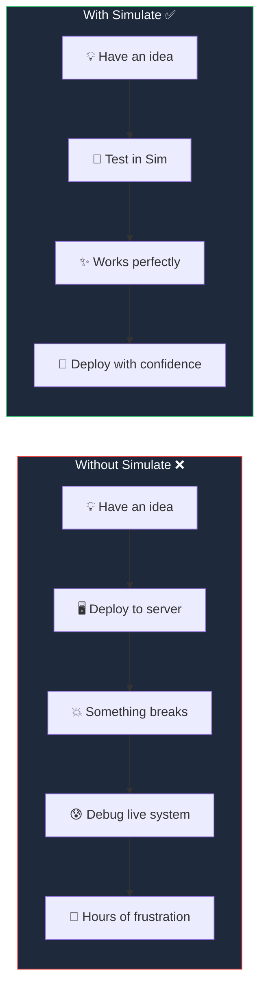
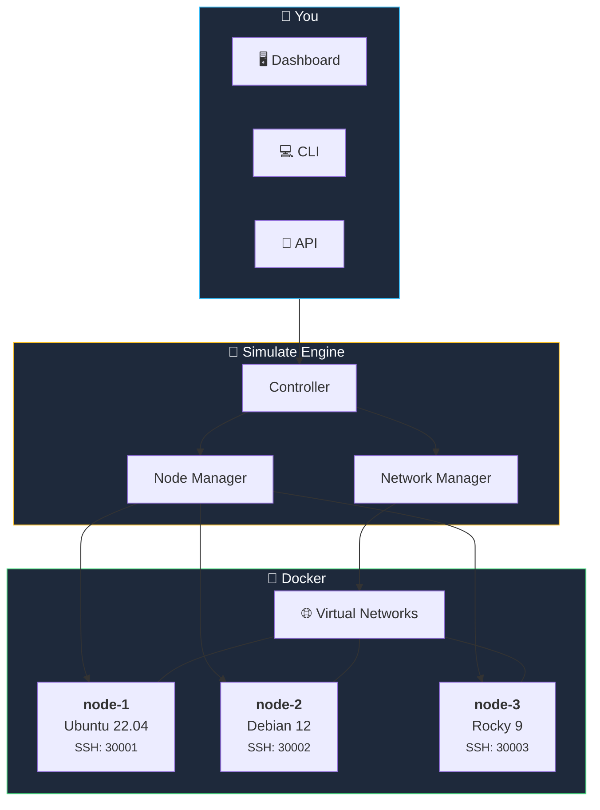
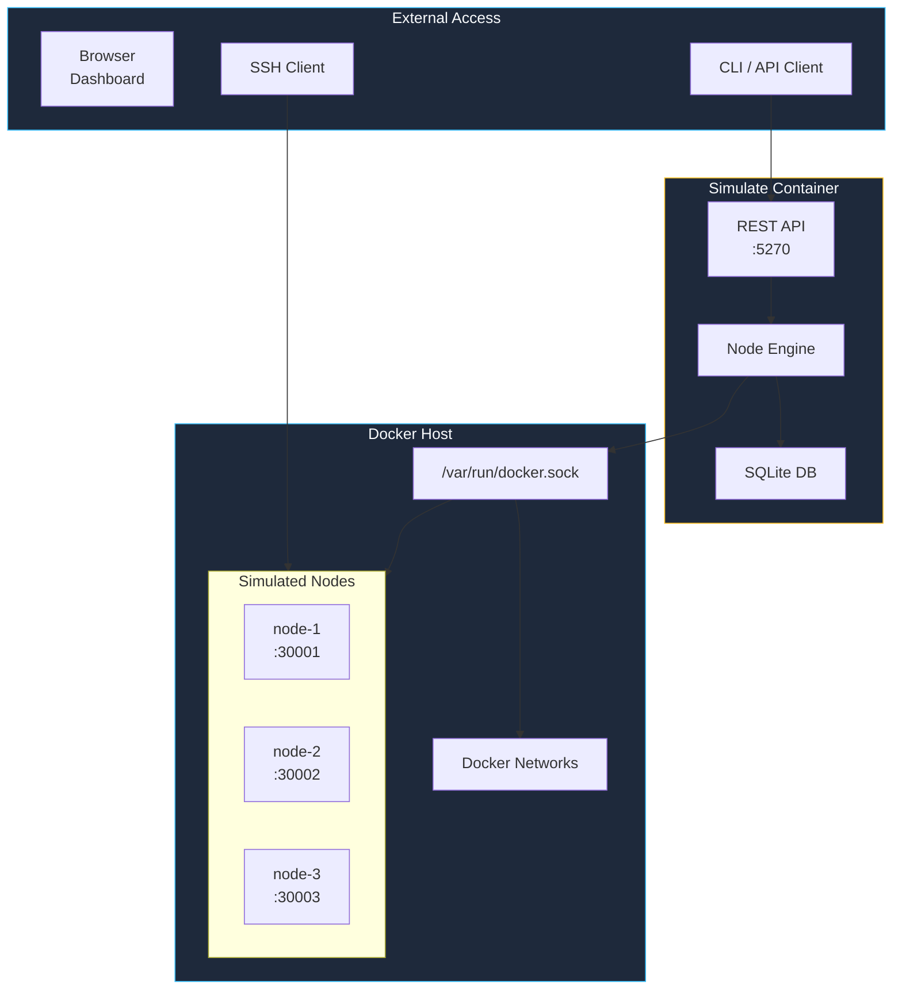
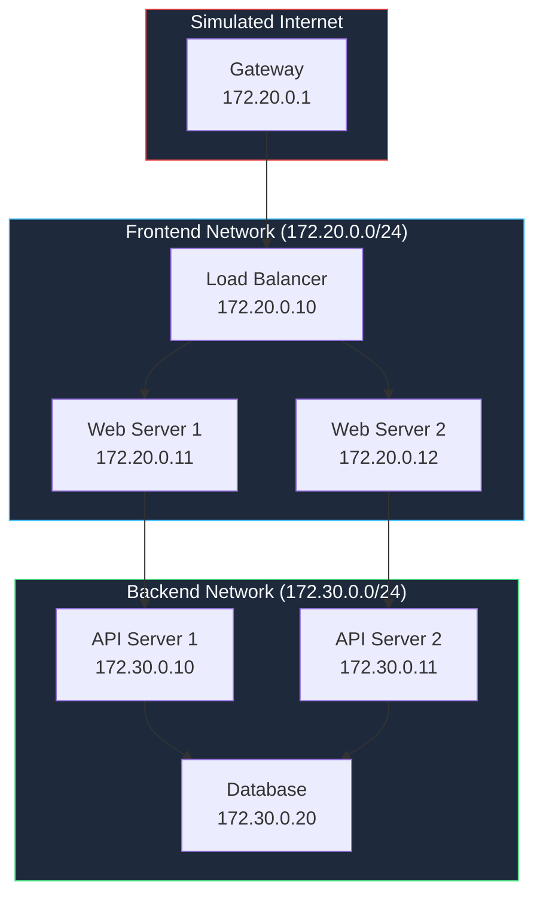

**kombify Simulate** lets you test your homelab configuration in a safe sandbox. Make mistakes, break things, learn — without risking your real servers.

## The simple version

<Card title="What is Simulate?" icon="lightbulb">
  kombify Simulate creates virtual servers on your computer using Docker. These virtual servers look and act like real servers — you can SSH into them, install software, and test your entire homelab setup.

  When something breaks, just delete it and start over in seconds.
</Card>

## Why use Simulate?



<Accordion title="🔧 Technical details" icon="code">
  kombify Simulate uses multiple engines (Docker, Incus, QEMU, Azure, DigitalOcean) to simulate real Linux servers. Each simulated node:
  - Runs a complete Linux distribution (Ubuntu, Debian, Rocky, Alpine)
  - Has its own SSH server accessible on unique ports (30000-39999)
  - Can be networked together in custom topologies
  - Supports resource limits matching real hardware specs

  **Architecture:** Go backend with REST API for automation. Supports 5 engines for different fidelity levels.
</Accordion>

## Key features

<CardGroup cols={2}>
  <Card title="Instant servers" icon="bolt">
    Spin up simulated servers in seconds — no ISO downloads or VM setup
  </Card>
  <Card title="Real SSH access" icon="terminal">
    SSH into any simulated server just like a real one
  </Card>
  <Card title="Safe experimentation" icon="flask">
    Break things without consequences — delete and recreate in seconds
  </Card>
  <Card title="Network simulation" icon="network-wired">
    Test multi-node setups with custom networks and topologies
  </Card>
</CardGroup>

## How it works



<Steps>
  <Step title="Start Simulate" icon="play">
    Run kombify Simulate via Docker — it needs access to Docker socket to create containers
  </Step>
  <Step title="Create simulation" icon="plus">
    Name your simulation and choose which nodes you want
  </Step>
  <Step title="Add nodes" icon="server">
    Add virtual servers with your choice of OS and resources
  </Step>
  <Step title="Connect and test" icon="terminal">
    SSH into nodes, install software, test your configuration
  </Step>
  <Step title="Clean up" icon="trash">
    Delete the simulation when done — everything disappears
  </Step>
</Steps>

## Quick Start

<Steps>
  <Step title="Start Simulate">
    ```bash
    docker run -d \
      -p 5270:5270 \
      -p 30000-39999:30000-39999 \
      -v /var/run/docker.sock:/var/run/docker.sock \
      ghcr.io/kombifyio/simulate:latest
    ```
  </Step>
  
  <Step title="Verify API">
    Check the API is running:
    ```bash
    curl http://localhost:5270/health
    ```
  </Step>
  
  <Step title="Create Simulation">
    ```bash
    curl -X POST http://localhost:5270/api/v1/simulations \
      -H "Content-Type: application/json" \
      -d '{"name": "my-homelab"}'
    ```
  </Step>
  
  <Step title="Add Nodes">
    ```bash
    curl -X POST http://localhost:5270/api/v1/nodes \
      -H "Content-Type: application/json" \
      -d '{
        "name": "server-1",
        "simulation_id": "sim_xxx",
        "os": "ubuntu-22.04",
        "resources": {
          "cpu": 2,
          "memory": "2048Mi"
        }
      }'
    ```
  </Step>
  
  <Step title="SSH into Node">
    ```bash
    # Port is assigned dynamically from range 30000-39999
    # Check the node details for the assigned SSH port
    ssh -p 30001 root@localhost
    # Password: kombifysim
    ```
  </Step>
</Steps>

## Architecture



## Supported Operating Systems

| OS | Image |
|----|-------|
| Ubuntu 22.04 | `ubuntu-22.04` |
| Ubuntu 24.04 | `ubuntu-24.04` |
| Debian 12 | `debian-12` |
| Rocky Linux 9 | `rocky-9` |
| Alpine 3.19 | `alpine-3.19` |

<Note>
  SSH ports are dynamically assigned from the range 30000-39999. Check the node details via API for the assigned port.
</Note>

## Simulation Engines

kombify Simulate supports multiple backends for different fidelity levels:

| Engine | Type | Best for |
|--------|------|----------|
| **Docker** | Container-based | Fast iteration, CI/CD (default) |
| **Incus** | System container | Full OS simulation with systemd |
| **QEMU** | Virtual machine | Hardware-level fidelity |
| **Azure** | Cloud VM | Real cloud infrastructure testing |
| **DigitalOcean** | Cloud VM | Real cloud infrastructure testing |

Set the engine via the `SIM_ENGINE` environment variable.

## Use Cases

<Tabs>
  <Tab title="Testing StackKits">
    Test a StackKit configuration before deploying:
    
    ```bash
    # Start simulation
    kombify sim start --from stack-spec.yaml
    
    # Run validation
    kombify validate --against-sim
    
    # Deploy to simulation
    kombify deploy --target sim
    
    # Verify everything works
    kombify test --target sim
    ```
  </Tab>
  
  <Tab title="Multi-Node Testing">
    Test HA configurations with multiple nodes:
    
    ```yaml
    # sim-config.yaml
    simulation:
      name: ha-test
      
    nodes:
      - name: node-1
        os: ubuntu-22.04
        role: primary
        
      - name: node-2
        os: ubuntu-22.04
        role: replica
        
      - name: node-3
        os: ubuntu-22.04
        role: replica
    
    network:
      subnet: 172.20.0.0/24
    ```
  </Tab>
  
  <Tab title="CI/CD Testing">
    Run tests in CI pipelines:
    
    ```yaml
    # .github/workflows/test.yml
    jobs:
      test:
        runs-on: ubuntu-latest
        steps:
          - uses: kombifyio/sim-action@v1
            with:
              config: test-config.yaml
              
          - name: Run integration tests
            run: |
              kombify test --target sim
    ```
  </Tab>
</Tabs>

## API Overview

<Note>
  **Base URL:** `https://api.kombify.io/v1/simulation` (SaaS) or `http://localhost:5270/api/v1` (self-hosted/local)
</Note>

### Simulations

```bash
# List simulations
curl https://api.kombify.io/v1/simulation/simulations

# Create simulation
curl -X POST https://api.kombify.io/v1/simulation/simulations \
  -d '{"name": "test"}'

# Delete simulation
curl -X DELETE https://api.kombify.io/v1/simulation/simulations/{id}
```

### Nodes

```bash
# List nodes in simulation
curl https://api.kombify.io/v1/simulation/nodes?simulation_id={sim_id}

# Create node
curl -X POST https://api.kombify.io/v1/simulation/nodes \
  -d '{
    "name": "web-server",
    "simulation_id": "sim_xxx",
    "os": "ubuntu-22.04"
  }'

# Get node details
curl https://api.kombify.io/v1/simulation/nodes/{id}

# Delete node
curl -X DELETE https://api.kombify.io/v1/simulation/nodes/{id}
```

## Resource Limits

Configure resources per node:

```bash
curl -X POST https://api.kombify.io/v1/simulation/nodes \
  -d '{
    "name": "db-server",
    "os": "ubuntu-22.04",
    "resources": {
      "cpu": 4,
      "memory": "4096Mi",
      "disk": "20Gi"
    }
  }'
```

## Networking

### Custom Networks

```bash
# Create isolated network
curl -X POST https://api.kombify.io/v1/simulation/networks \
  -d '{
    "name": "backend",
    "subnet": "172.30.0.0/24",
    "simulation_id": "sim_xxx"
  }'

# Attach node to network
curl -X POST https://api.kombify.io/v1/simulation/nodes/{id}/networks \
  -d '{"network_id": "net_xxx", "ip": "172.30.0.10"}'
```

### Network Topology Example



## Best Practices

<AccordionGroup>
  <Accordion title="Use realistic resource limits">
    Match your simulation resources to actual hardware specs:
    
    ```yaml
    nodes:
      - name: raspberry-pi
        resources:
          cpu: 4
          memory: "4096Mi"  # 4GB like real Pi 4
    ```
  </Accordion>
  
  <Accordion title="Test failure scenarios">
    kombify Simulate lets you safely test failures:
    
    ```bash
    # Stop a node to test failover
    curl -X POST https://api.kombify.io/v1/simulation/nodes/{id}/stop
    
    # Simulate network partition
    curl -X POST https://api.kombify.io/v1/simulation/networks/{id}/disconnect \
      -d '{"node_id": "node_xxx"}'
    ```
  </Accordion>
  
  <Accordion title="Clean up after testing">
    Delete simulations when done to free resources:
    
    ```bash
    curl -X DELETE https://api.kombify.io/v1/simulation/simulations/{id}
    ```
  </Accordion>
</AccordionGroup>

## Next Steps

<CardGroup cols={2}>
  <Card title="Self-Hosting Guide" icon="server" href="/sim/how-to/self-hosting">
    Deploy Simulate on your own infrastructure
  </Card>
  <Card title="Templates" icon="book" href="/sim/how-to/templates">
    Pre-built simulation templates
  </Card>
  <Card title="Simulation Engines" icon="gear" href="/sim/explanations/simulation-engines">
    Understanding the different engine backends
  </Card>
  <Card title="API Reference" icon="code" href="/api/kombifysim/overview">
    Full API documentation
  </Card>
</CardGroup>
