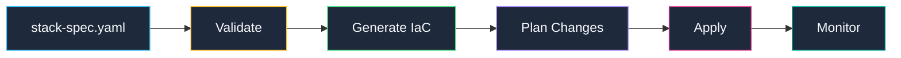

Learn how to deploy, update, and manage your infrastructure using kombify TechStack's deployment pipeline.

## Deployment workflow



## Deploy a new stack

<Steps>
  <Step title="Create your spec file">
    Create or update your `stack-spec.yaml`:
    
    ```yaml stack-spec.yaml
    stackkit: base-kit
    
    nodes:
      - name: main-server
        type: local
        connection:
          host: 192.168.1.100
          user: root
    
    services:
      traefik:
        enabled: true
      dokploy:
        enabled: true
    ```
  </Step>
  
  <Step title="Validate configuration">
    Validate your spec before deployment:
    
    ```bash
    curl -X POST https://api.kombify.io/v1/orchestrator/unifier/validate \
      -H "Content-Type: application/yaml" \
      --data-binary @stack-spec.yaml
    ```
    
    Or via the web UI: **Stack → Validate**
  </Step>
  
  <Step title="Generate infrastructure code">
    Generate OpenTofu and Docker configurations:
    
    ```bash
    curl -X POST https://api.kombify.io/v1/orchestrator/unifier/generate \
      -H "Content-Type: application/yaml" \
      --data-binary @stack-spec.yaml
    ```
  </Step>
  
  <Step title="Preview changes">
    See what will be created before applying:
    
    ```bash
    curl -X POST https://api.kombify.io/v1/orchestrator/unifier/preview \
      -H "Content-Type: application/yaml" \
      --data-binary @stack-spec.yaml
    ```
  </Step>
  
  <Step title="Apply deployment">
    Deploy to your infrastructure:
    
    ```bash
    curl -X POST https://api.kombify.io/v1/orchestrator/stacks/{stack-id}/provision
    ```
    
    This triggers the full deployment pipeline:
    1. Run pre-checks on target nodes
    2. Apply OpenTofu configuration
    3. Deploy Docker services
    4. Verify health checks
  </Step>
</Steps>

## Deployment states

| State | Description |
|-------|-------------|
| `pending` | Deployment queued |
| `validating` | Validating spec |
| `generating` | Generating IaC |
| `planning` | Running tofu plan |
| `applying` | Applying changes |
| `deploying` | Deploying services |
| `verifying` | Running health checks |
| `completed` | Successfully deployed |
| `failed` | Deployment failed |
| `rolled_back` | Rolled back to previous state |

## Update an existing stack

<Tabs>
  <Tab title="Rolling update">
    Apply changes without downtime:
    
    ```bash
    curl -X POST https://api.kombify.io/v1/orchestrator/stacks/{stack-id}/deploy \
      -H "Content-Type: application/json" \
      -d '{"strategy": "rolling"}'
    ```
  </Tab>
  <Tab title="Recreate">
    Stop all services, then redeploy:
    
    ```bash
    curl -X POST https://api.kombify.io/v1/orchestrator/stacks/{stack-id}/deploy \
      -H "Content-Type: application/json" \
      -d '{"strategy": "recreate"}'
    ```
  </Tab>
</Tabs>

## Destroy a stack

<Warning>
  This will permanently destroy all resources. Make sure to backup any data first.
</Warning>

```bash
curl -X POST https://api.kombify.io/v1/orchestrator/stacks/{stack-id}/destroy
```

## Deployment jobs

All deployments run as background jobs. Check job status:

```bash
# List recent jobs
curl https://api.kombify.io/v1/orchestrator/jobs

# Get specific job status
curl https://api.kombify.io/v1/orchestrator/jobs/{job-id}
```

### Job status response

```json
{
  "id": "job_abc123",
  "type": "provision",
  "status": "running",
  "progress": 65,
  "started_at": "2026-02-03T10:00:00Z",
  "steps": [
    {"name": "validate", "status": "completed"},
    {"name": "generate", "status": "completed"},
    {"name": "apply", "status": "running"},
    {"name": "verify", "status": "pending"}
  ]
}
```

## Pre-deployment checks

Stack runs pre-checks before deployment to ensure nodes are ready:

| Check | Description |
|-------|-------------|
| **Connectivity** | SSH/agent connection working |
| **OS compatibility** | Supported distribution and version |
| **Resources** | Sufficient CPU, RAM, disk |
| **Docker** | Docker installed and running |
| **Ports** | Required ports available |

```bash
# Run pre-checks manually
curl -X POST https://api.kombify.io/v1/orchestrator/workers/{worker-id}/prechecks
```

## Rollback

If a deployment fails, Stack can rollback to the previous state:

```bash
# Automatic rollback (enabled by default)
curl -X POST https://api.kombify.io/v1/orchestrator/stacks/{stack-id}/deploy \
  -d '{"auto_rollback": true}'

# Manual rollback
curl -X POST https://api.kombify.io/v1/orchestrator/stacks/{stack-id}/rollback
```

## Next steps

<CardGroup cols={2}>
  <Card title="Monitoring" icon="chart-line" href="/stack/reference/monitoring">
    Monitor your deployed infrastructure
  </Card>
  <Card title="Drift detection" icon="arrows-rotate" href="/stack/reference/troubleshooting">
    Detect and fix configuration drift
  </Card>
</CardGroup>
