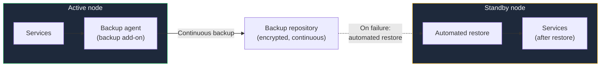
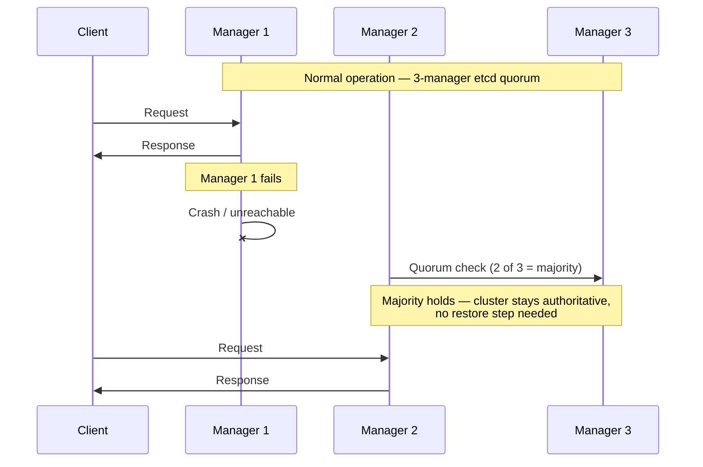

High Availability is an **add-on**, not a separate kit. You deploy a StackKit — [Basement Kit, Cloud Kit, or Modern Homelab](/stackkits/overview) — and layer the `ha` add-on on top when downtime starts to have real consequences.

<Note>
  Earlier versions of these docs described high availability as a standalone kit. That packaging is retired: high availability now ships as the `ha` add-on overlay and composes with the marketed kits like any other add-on.
</Note>

## What HA means for a StackKit deployment

A single-node deployment has a single point of failure: if that node goes down, everything on it goes down with it. The `ha` add-on removes that single point of failure in one of two ways, with different recovery guarantees and different node requirements:

| Tier | Minimum nodes | Mechanism | Downtime on failure |
|------|---------------|-----------|---------------------|
| **Warm standby** | 2 | Continuous backup + automated restore to a standby node | Roughly the restore time |
| **Quorum** | 3 (odd manager count) | etcd-quorum live failover | Near zero |

## Warm standby

Warm standby builds on the **backup add-on** (Kopia-based encrypted backups with built-in database hooks). The active node is backed up continuously; when it fails, the add-on restores the latest backup onto a standby node automatically and services come back up there.



Key properties:

- **Downtime equals restore time.** Recovery is automated, but the standby node has to restore state before it can serve traffic. How long that takes depends on how much data your services hold.
- **Two nodes are enough.** There is no cluster consensus involved — one node runs the stack, the other is the restore target.
- **Your backups get exercised.** Because failover *is* a restore, the mechanism continuously proves that your backups are actually restorable — not just configured.

Warm standby is the right tier when a short, bounded outage is acceptable and you want meaningful failure protection from just two nodes.

## Quorum

The quorum tier keeps a redundant control plane running at all times: at least **three manager nodes, always an odd count**, coordinated through etcd quorum. When a manager fails, the remaining majority keeps the cluster authoritative and workloads keep running or fail over live — there is no restore step.



Key properties:

- **Near-zero downtime.** Failover is live; the surviving majority continues serving.
- **Redundant control planes require quorum.** StackKits never support running multiple control planes without quorum — the validator rejects that topology as a split-brain risk rather than deploying it.
- **Odd node counts only.** Three or five managers, never two or four (see below for why).

<Warning>
  Whichever tier you run: test failover deliberately, in a maintenance window, before you rely on it. High availability is an operating model, not a checkbox — see the [HA readiness guide](/guides/stackkits/high-availability-readiness).
</Warning>

## Node floors are technical prerequisites, not pricing tiers

The minimum node counts are dictated by failure math, not by licensing:

- **Warm standby needs ≥ 2 nodes** because there must be a second machine to restore onto. With one node, there is nowhere to fail over to.
- **Quorum needs ≥ 3 managers, odd count,** because an authoritative decision requires a majority of managers to agree. Two managers cannot do this: a network partition leaves each side with exactly half the votes and no majority — the classic **split-brain** scenario, where both halves believe they are in charge. With three managers, any partition leaves one side holding a 2-of-3 majority; with five, 3-of-5. Even counts add hardware without adding failure tolerance.

Nothing about high availability is paywalled. The add-on is open source and self-hostable like the rest of StackKits — if you have the nodes, you can run either tier. kombify's managed offerings add convenience around it (hosting, provisioning, lifecycle management), never the capability itself.

## Enabling the add-on

HA is opt-in like any other add-on — declare it in your stack spec alongside the rest:

```yaml stack-spec.yaml
addons:
  - backup   # warm standby builds on the backup add-on
  - ha
```

Validation enforces the node floor for the tier you run. If your spec does not meet it, you get a constraint error before anything deploys — not a degraded cluster after.

## Next steps

<CardGroup cols={2}>
  <Card title="HA readiness guide" icon="clipboard-check" href="/guides/stackkits/high-availability-readiness">
    Check whether your infrastructure and operations are ready for HA
  </Card>
  <Card title="Add-ons overview" icon="puzzle-piece" href="/stackkits/addons/overview">
    Browse all available add-ons, including backup and monitoring
  </Card>
  <Card title="Monitoring reference" icon="chart-line" href="/stackkits/reference/monitoring">
    Monitoring exists to detect failures — set it up before you need it
  </Card>
  <Card title="Choosing a kit" icon="compass" href="/guides/stackkits/choosing-a-kit">
    Pick the kit to layer the HA add-on onto
  </Card>
</CardGroup>
