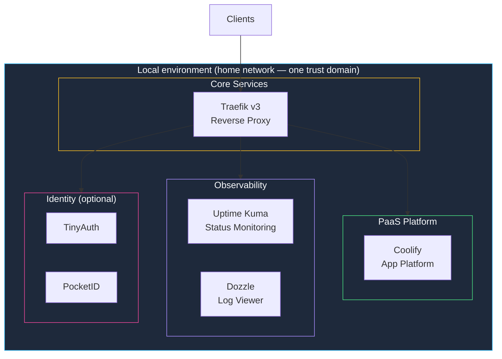

The **Basement Kit** is the local single-environment homelab kit. Every node lives in the same place — your home network — inside **one trust domain**, with **exactly one main node** (the control plane) and any number of additional nodes. Supported contexts are `local` and `pi`.

Its installer lives at `base.stackkit.cc` — "base" as in **home base**:

```bash
curl -sSL https://base.stackkit.cc | sh
```

<Note>
  **Deprecated alias:** `stackkit init base-kit` still works, but it aliases to `basement-kit` and prints a deprecation warning. Use `stackkit init basement-kit` in new specs and scripts.
</Note>

<Note>
  The Basement Kit follows an IaC-first approach using packaged OpenTofu plus a selected PaaS adapter. Coolify is the default beta path, and Komodo is the supported beta alternative.
</Note>

## Overview



## Node model

The Basement Kit is **not** limited to one server. It runs on 1..N nodes — what stays fixed is the control plane:

| Rule | Value |
|------|-------|
| Trust domain | Exactly one |
| Main node (control plane) | Exactly one |
| Additional nodes | 0..N, roles `worker` or `storage` |
| Join mechanism | Worker/storage nodes join the main via a **join token** |

A three-node stack in your basement is still a Basement Kit. The boundaries to the other kits are drawn by locality and control plane, not node count:

| Topology | Kit |
|----------|-----|
| All nodes local or Pi | **Basement Kit** |
| All nodes in the cloud | [Cloud Kit](https://docs.kombify.io/stackkits/kits/cloud-kit) |
| At least one local **and** one cloud node, joined by the bridge contract | [Modern Homelab](https://docs.kombify.io/stackkits/kits/modern-homelab) |

<Note>
  **High Availability is an add-on, not a kit.** The `ha` add-on ships two tiers: `warm-standby` (continuous backup plus automated restore to a standby node, requires at least 2 nodes) and `quorum` (etcd live failover, requires at least 3 odd-numbered manager nodes). The node floors are technical prerequisites of each mechanism, never paywalls.
</Note>

## Common starting profiles

The Basement Kit does not rely on a monolithic `variant` selector. Start from the baseline and use context, mode, and add-ons to shape the deployment.

<Tabs>
  <Tab title="Baseline">
    The standard single-environment path.

    | Surface | Description |
    |---------|-------------|
    | **Traefik v3** | Reverse proxy with auto-SSL |
    | **Coolify** | App platform (PaaS) - beta default |
    | **Komodo** | Beta-supported alternative PaaS |
    | **Uptime Kuma** | Lightweight uptime and status pages |
    | **Dozzle** | Real-time Docker log viewer |
    | **monitoring-agent** | OTLP collector baseline enabled by default |

    ```yaml stack-spec.yaml
    stackkit: basement-kit
    ```
  </Tab>
  <Tab title="With monitoring-core">
    Add centralized fan-in and longer retention when the deployment needs it.

    | Surface | Description |
    |---------|-------------|
    | **monitoring-agent** | Default node-level OTLP collector |
    | **monitoring-core** | Optional OTLP gateway and retention tier |
    | **VictoriaMetrics** | Optional durable metrics backend |
    | **Grafana** | Optional dashboards when enabled with the backend tier |

    ```yaml stack-spec.yaml
    stackkit: basement-kit

    addons:
      - monitoring-core
    ```
  </Tab>
  <Tab title="Low-resource intent (pi)">
    Lightweight operator intent for constrained hardware such as a Raspberry Pi.

    | Surface | Description |
    |---------|-------------|
    | **mode: pi** | Forces the lightweight experience |
    | **monitoring-agent** | Keeps the collector baseline |
    | **No retention tier by default** | Avoids heavier fan-in and storage services |

    ```yaml stack-spec.yaml
    stackkit: basement-kit
    mode: pi
    ```
  </Tab>
</Tabs>

## Included services

<Note>
  The app platform is **context-resolved**. The public beta defaults to **Coolify** and supports **Komodo** as the beta alternative. Dokploy remains draft/non-beta and is not part of the canonical beta E2E matrix.
</Note>

<CardGroup cols={2}>
  <Card title="Traefik v3" icon="route">
    **Reverse Proxy & SSL**

    Automatic HTTPS certificates, routing, and load balancing for all services.
  </Card>
  <Card title="Coolify" icon="cloud">
    **App platform (beta default)**

    Self-hosted PaaS like Vercel/Heroku. The Basement Kit bootstraps Coolify, enables its API, stores platform placement state, and deploys StackKit-owned apps through Coolify.
  </Card>
  <Card title="Komodo" icon="rocket">
    **Beta-supported alternative**

    Komodo is the supported beta alternative PaaS adapter. Dokploy remains draft until promoted by its own release evidence.
  </Card>
  <Card title="Uptime Kuma" icon="heart-pulse">
    **Status Monitoring**

    Monitor your services with beautiful status pages and alerts.
  </Card>
  <Card title="Dozzle" icon="list">
    **Log Viewer**

    Real-time Docker container log viewer in your browser.
  </Card>
  <Card title="monitoring-agent" icon="gauge">
    **Collector baseline**

    Per-node OTLP collector enabled by default; add `monitoring-core` for central fan-in and retention.
  </Card>
</CardGroup>

### Identity services (optional)

<CardGroup cols={2}>
  <Card title="TinyAuth" icon="key">
    **Lightweight auth proxy**

    Gateway auth boundary for protected routes.
  </Card>
  <Card title="PocketID" icon="id-card">
    **Passkey-first OIDC provider**

    Owner activation and passkey login for the beta path.
  </Card>
</CardGroup>

## Requirements

| Resource | Low | Standard | High |
|----------|-----|----------|------|
| **CPU** | 2 cores | 4 cores | 8 cores |
| **RAM** | 4 GB | 8 GB | 16 GB |
| **Storage** | 20 GB SSD | 50 GB SSD | 100+ GB SSD |
| **Observability** | Collector baseline only | Collector baseline | Collector baseline + optional monitoring-core |

### Supported operating systems

| OS | Version | Status |
|----|---------|--------|
| Ubuntu | 24.04 LTS | ✅ Recommended |
| Ubuntu | 22.04 LTS | ✅ Supported |
| Debian | 12 (Bookworm) | ✅ Supported |

## Quick start

<Steps>
  <Step title="Create your spec file">
    ```yaml stack-spec.yaml
    stackkit: basement-kit

    # Node configuration
    nodes:
      - name: main-server
        type: local
        connection:
          host: 192.168.1.100
          user: root
          ssh_key: ~/.ssh/id_ed25519

    # Domain (optional - enables auto-SSL)
    domain: homelab.example.com
    email: you@example.com

    # Service toggles
    services:
      coolify:
        enabled: true
      uptime_kuma:
        enabled: true
      dozzle:
        enabled: true
    ```
  </Step>

  <Step title="Validate configuration">
    ```bash
    stackkit validate
    ```

    The validator confirms the kit, monitoring baseline, OS, compute tier, service dependencies, and port assignments before anything is generated.
  </Step>

  <Step title="Generate infrastructure code">
    ```bash
    stackkit generate
    ```

    Creates:
    - `deploy/` - generated OpenTofu input and output files
    - `.stackkit/platform.json` - selected PaaS placement and API context after apply
    - `.stackkit/state.yaml` - setup-run state and retry-safe setup action evidence
    - service output files with Base Hub, identity, monitoring, and application URLs
  </Step>

  <Step title="Preview and apply">
    ```bash
    stackkit plan   # Preview changes
    stackkit apply  # Deploy
    ```
  </Step>
</Steps>

## Configuration reference

### Node settings

```yaml
nodes:
  - name: main-server
    type: local
    os: ubuntu-24            # ubuntu-24, ubuntu-22, debian-12

    connection:
      host: 192.168.1.100
      port: 22
      user: root
      ssh_key: ~/.ssh/id_ed25519
      # OR password: ${SSH_PASSWORD}

    resources:               # Optional — auto-detected
      cpu: 4
      memory_gb: 8
      disk_gb: 50
```

Additional nodes carry the `worker` or `storage` role and join the main node via the generated join token. There is never a second main.

### Domain and SSL

A canonical `network.domain.base` is **required** for the Basement Kit — `stackkit init basement-kit` refuses to establish runtime custody without it. The bootstrapped services derive their hostnames from that base:

| Service | URL |
|---------|-----|
| Basement Hub | `<domain>` |
| PocketID | `id.<domain>` |
| TinyAuth | `auth.<domain>` |
| Coolify | `coolify.<domain>` |
| step-ca | `ca.<domain>` |

Pick a real routable domain when you want public TLS, or a local development domain (for example `home.test` or `home.localhost`) that you resolve on your LAN.

<Tabs>
  <Tab title="Routable domain">
    ```yaml
    network:
      domain:
        base: homelab.example.com

    email: you@example.com

    ssl:
      provider: letsencrypt
      # Optional: wildcard for *.homelab.example.com
      wildcard: true
    ```
  </Tab>
  <Tab title="Local domain">
    ```yaml
    network:
      domain:
        base: home.test

    ssl:
      provider: selfsigned
    ```

    Point `home.test` (and each `id.`, `auth.`, `coolify.` subdomain) at your main node — for example through your router's DNS overrides or `/etc/hosts` entries. Self-signed certificates from the embedded step-ca cover `*.<domain>`.
  </Tab>
</Tabs>

### Service configuration

```yaml
services:
  traefik:
    enabled: true           # Always required
    dashboard: true         # Enable Traefik UI
    log_level: INFO

  coolify:
    enabled: true
    # Coolify runs on port 8000 by default

  uptime_kuma:
    enabled: true
    public_page: true       # Enable public status page

  dozzle:
    enabled: true
    remote_hosts: []        # Add remote Docker hosts

  # Identity is part of the beta baseline unless intentionally overridden
  tinyauth:
    enabled: true

  pocketid:
    enabled: true
```

## Deployment modes

The Basement Kit supports these public install modes:

| Mode | Engine | When to use |
|------|--------|-------------|
| **Bare** | Packaged OpenTofu without Base Hub/setup automation | Manual or BYOS foundations |
| **Bootstrapped** | Packaged OpenTofu plus Base Hub, identity, monitoring, and setup actions | Default public beta path |
| **Advanced** | Bootstrapped plus advanced handoff/runtime metadata | TechStack/Komodo and guided handoff paths |

Terramate remains an explicit `terramate` / `advanced-terramate` opt-in until its stack templates have release-grade evidence.

```yaml
# Default beta mode
mode: bootstrapped
```

## File structure

After `stackkit generate`:

```text
.
├── stack-spec.yaml          # Your configuration
├── deploy/                  # Generated OpenTofu inputs and outputs
├── .stackkit/
│   ├── platform.json        # Selected PaaS context after apply
│   ├── state.yaml           # Setup-run state
│   └── security-baseline.json
└── artifacts/               # Optional local evidence and diagnostics
```

## Constraints

The Basement Kit enforces these rules:

| Constraint | Value | Reason |
|------------|-------|--------|
| Locality | Local (`local` / `pi` contexts) | Single-environment, single trust domain |
| Main nodes | Exactly one | One control plane; redundant control planes belong to the `ha` add-on quorum tier |
| Traefik required | Yes | All services need routing |
| Min RAM | 4 GB | Services won't fit in less |

<Warning>
  The Basement Kit serves a local single-environment pattern. If you need:
  - **Cloud-only on your own VPS** — [Cloud Kit](https://docs.kombify.io/stackkits/kits/cloud-kit)
  - **Hybrid local + cloud** — [Modern Homelab](https://docs.kombify.io/stackkits/kits/modern-homelab)
  - **Failover and redundancy** — the `ha` add-on (`warm-standby` or `quorum` tier) on top of your kit
</Warning>

<Warning>
  **Upgrading from StackKits v0.14.12 or earlier.** The Basement runtime custody manifest moves from `v2` to `v3` and records the resolved domain. On-disk custody written by an older version is rejected on upgrade and must be re-established. Set `network.domain.base` in your spec, remove the existing custody bundle under `.stackkit/custody/basement-runtime/`, then rerun `stackkit init basement-kit` to write a fresh v3 manifest. The domain recorded in custody must match the spec on every subsequent run.
</Warning>

## Troubleshooting

<AccordionGroup>
  <Accordion title="Services not accessible">
    1. Check Traefik is running: `docker logs traefik`
    2. Verify DNS resolves to your server
    3. Check firewall allows ports 80/443
    4. For local: Use `http://IP:PORT` instead of domain
  </Accordion>

  <Accordion title="SSL certificate errors">
    - **Let's Encrypt**: Domain must be publicly accessible
    - **Self-signed**: Add browser exception or use `curl -k`
    - Check rate limits at https://letsencrypt.org/docs/rate-limits/
  </Accordion>

  <Accordion title="Coolify not starting">
    1. Check port 8000 is not in use: `netstat -tlnp | grep 8000`
    2. Verify Docker socket permissions
    3. Check logs: `docker logs coolify`
  </Accordion>

  <Accordion title="Low disk space warnings">
    1. Prune unused images: `docker image prune -a`
    2. Check volume sizes: `docker system df`
    3. Consider adding external storage
  </Accordion>
</AccordionGroup>

## Next steps

<CardGroup cols={2}>
  <Card title="Node Hub" icon="grid-2" href="https://docs.kombify.io/guides/stackkits/node-hub">
    Open the standard `base.<domain>` dashboard and service guide matrix.
  </Card>
  <Card title="Cloud Kit" icon="cloud" href="https://docs.kombify.io/stackkits/kits/cloud-kit">
    The same single-environment model on your own VPS.
  </Card>
  <Card title="Modern Homelab" icon="microchip" href="https://docs.kombify.io/stackkits/kits/modern-homelab">
    Grow your Basement into a hybrid local + cloud setup (Preview).
  </Card>
  <Card title="CUE basics" icon="code" href="https://docs.kombify.io/stackkits/explanations/cue-architecture">
    Learn how to customize StackKit schemas.
  </Card>
</CardGroup>
