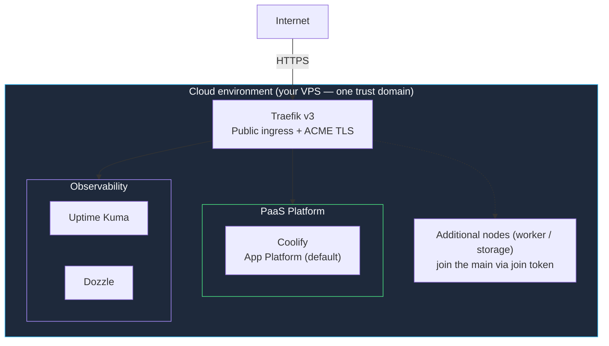

The **Cloud Kit** is the cloud adaptation of the Basement profile. It uses the exact same single-environment node model — **one trust domain**, **exactly one main node** (the control plane), 1..N nodes with worker/storage nodes joining via a join token — but every node runs in the cloud (`context: cloud`), typically on a VPS you bring yourself.

Its installer lives at `cloud.stackkit.cc`:

```bash
curl -sSL https://cloud.stackkit.cc | sh
```

<Note>
  The Cloud Kit is fully open source and BYO-VPS: you lease the server, StackKits configure it. The kit's public onboarding is younger than the Basement Kit's — in particular the public-IP and custom-domain flow is still being polished. Expect rougher edges than on the Basement path.
</Note>

## Overview



## Same model as Basement, cloud defaults

The Cloud Kit is a profile over the same shared node model as the Basement Kit — not a separate architecture. What changes are the context-derived defaults:

| Characteristic | Basement Kit (`local` / `pi`) | Cloud Kit (`cloud`) |
|----------------|-------------------------------|---------------------|
| Public access | Private by default | **Public ingress by default** |
| TLS | Self-signed / local defaults | **ACME (Let's Encrypt) certificates** |
| Reachability | LAN / home network | **Public IP + your domain** |
| Node model | 1 trust domain, 1 main, 1..N nodes | Identical |

On top of the shared model, the Cloud Kit may carry a small set (1–2) of cloud-only extensions — for example around public ingress or DNS — which can later be promoted into the shared standard.

## What the Cloud Kit is not

<Warning>
  The Cloud Kit is **not** the Modern Homelab. All Cloud Kit nodes live in the cloud, inside one trust domain — there is no hybrid bridge to a home network. The moment you want at least one local node **and** at least one cloud node connected by the bridge contract, you are building a [Modern Homelab](https://docs.kombify.io/stackkits/kits/modern-homelab).
</Warning>

Likewise, node count does not change the kit: a three-VPS deployment in one trust domain is still a Cloud Kit. Redundant control planes are not a Cloud Kit topology either — that is the `ha` add-on's `quorum` tier (at least 3 odd-numbered manager nodes, a technical prerequisite of etcd quorum, not a paywall).

## Requirements

- A VPS (or several) from any provider — the kit is bring-your-own-VPS
- A public IPv4 address on the main node
- A domain you control, for public ingress and ACME certificates
- SSH access to every node

## PaaS adapter

Like the Basement Kit, the app platform is context-resolved:

| Adapter | Status |
|---------|--------|
| **Coolify** | Default |
| **Komodo** | Supported alternative |
| **Dokploy** | Draft — not part of the supported matrix yet |

## Quick start

<Steps>
  <Step title="Create your spec file">
    ```yaml stack-spec.yaml
    stackkit: cloud-kit

    nodes:
      - name: main-vps
        type: cloud
        connection:
          host: 203.0.113.10
          user: root
          ssh_key: ~/.ssh/id_ed25519

    # Required for public ingress + ACME TLS
    domain: example.com
    email: you@example.com
    ```
  </Step>

  <Step title="Validate, generate, apply">
    ```bash
    stackkit validate
    stackkit generate
    stackkit plan
    stackkit apply
    ```
  </Step>
</Steps>

## Next steps

<CardGroup cols={2}>
  <Card title="Basement Kit" icon="house" href="https://docs.kombify.io/stackkits/kits/basement-kit">
    The local sibling — same node model, home-network defaults.
  </Card>
  <Card title="Modern Homelab" icon="microchip" href="https://docs.kombify.io/stackkits/kits/modern-homelab">
    Combine local and cloud nodes with the bridge contract (Preview).
  </Card>
</CardGroup>
