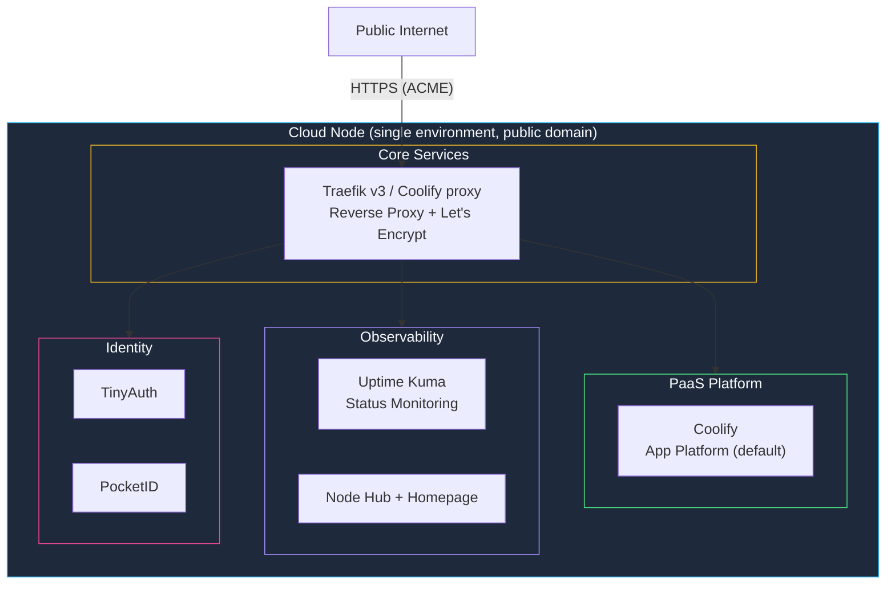

The **Cloud Kit** is the cloud/VPS profile of the same shared StackKits foundation used by the local Basement Kit. It targets a single cloud server reachable over SSH — a VPS you already lease from any provider (Hetzner, DigitalOcean, Vultr, and similar), or a server provisioned through kombify TechStack — and resolves the base library's defaults for `context: cloud`: Let's Encrypt certificates on a public domain instead of self-signed local TLS, and reverse-proxy access instead of local ports.

<Note>
  Cloud Kit shares roughly 90% of its definition with the local Basement Kit (internally paired as "Basement Kit" for the local/pi context). Only the context-derived defaults differ — TLS, access model, and domain requirement. See [Relationship to the Basement Kit](#relationship-to-the-basement-kit) below.
</Note>

## Overview



The shared base library models a single-environment kit as 1..N nodes with exactly one `main`. Cloud Kit's current release contract declares `multiNode: false` — treat it as a single VPS/server until multi-node cloud gets its own release evidence.

## Common starting profiles

Cloud Kit resolves two domain access modes. Both use the same service baseline; only the DNS/TLS path differs.

<Tabs>
  <Tab title="Own/custom domain">
    Bring your own domain and DNS provider.

    | Surface | Description |
    |---------|-------------|
    | **domain** | Your own or custom domain (e.g. `homelab.example.com`) |
    | **TLS** | Let's Encrypt via DNS-01 challenge |
    | **DNS token** | `CLOUDFLARE_API_TOKEN` or `STACKKIT_DNS_TOKEN`, depending on provider |

    ```yaml stack-spec.yaml
    stackkit: cloud-kit
    context: cloud
    domain: homelab.example.com
    email: you@example.com

    tls:
      provider: cloudflare
      challenge: dns
    ```
  </Tab>
  <Tab title="Managed kombify.me subdomain">
    Use kombify's managed domain instead of bringing your own.

    | Surface | Description |
    |---------|-------------|
    | **domain** | `kombify.me` |
    | **TLS** | Let's Encrypt via kombify.me automation |
    | **Required** | `KOMBIFY_API_KEY` during `generate`/`apply` |

    ```yaml stack-spec.yaml
    stackkit: cloud-kit
    context: cloud
    domain: kombify.me
    email: you@example.com
    ```
  </Tab>
</Tabs>

## Included services

<Note>
  The app platform is **context-resolved**, same as the Basement Kit. Cloud Kit defaults to **Coolify** and supports **Komodo** as the beta-supported alternative. Dokploy remains draft and is not part of the canonical beta E2E matrix.
</Note>

<CardGroup cols={2}>
  <Card title="Traefik v3 / Coolify proxy" icon="route">
    **Reverse Proxy & SSL**

    Automatic HTTPS certificates (Let's Encrypt) on your public domain. The selected PaaS router owns the traffic path by default; a StackKit-owned Traefik only runs for explicit `paas: komodo`.
  </Card>
  <Card title="Coolify" icon="cloud">
    **App platform (default)**

    Self-hosted PaaS. Cloud Kit bootstraps Coolify, enables its API, stores platform placement state, and deploys StackKit-owned apps through it.
  </Card>
  <Card title="Komodo" icon="rocket">
    **Beta-supported alternative**

    Komodo is the supported beta alternative, proven on provider-leased fresh Ubuntu (SK-S2). Dokploy remains draft until promoted by its own release evidence.
  </Card>
  <Card title="Uptime Kuma" icon="heart-pulse">
    **Status Monitoring**

    Monitor your public services with status pages and alerts.
  </Card>
  <Card title="Node Hub" icon="grid-2">
    **Onboarding & service matrix**

    Lives at `https://base.<domain>`. First-run PocketID/TinyAuth onboarding, technical bootstrap credential reveal, and per-service how-to links.
  </Card>
  <Card title="Homepage" icon="house">
    **Start dashboard**

    Secondary generated dashboard at `https://home.<domain>`.
  </Card>
</CardGroup>

### Identity services

<CardGroup cols={2}>
  <Card title="TinyAuth" icon="key">
    **Lightweight auth proxy**

    Gateway auth boundary for protected public routes.
  </Card>
  <Card title="PocketID" icon="id-card">
    **Passkey-first OIDC provider**

    Owner activation and passkey login. Mandatory default — TinyAuth is generated with a PocketID OIDC provider.
  </Card>
</CardGroup>

### Default applications

<CardGroup cols={2}>
  <Card title="Photos" icon="images">
    **Immich**

    Photo gallery and memories: server, ML, Postgres/pgvecto-rs, and Redis-compatible cache, deployed through the selected PaaS.
  </Card>
  <Card title="Vault" icon="shield-halved">
    **Vaultwarden**

    Password management and secure notes.
  </Card>
  <Card title="Files" icon="folder-open">
    **Cloudreve** (Nextcloud as configured alternative)

    File storage, sharing, and document-management workflows.
  </Card>
  <Card title="Whoami" icon="circle-check">
    **Routing smoke test**

    TinyAuth-protected container that confirms routing end to end.
  </Card>
</CardGroup>

<Note>
  Media (Jellyfin), AI/LLM (Ollama), Dev (Gitea), Mail (Stalwart), Game servers, Remote desktop (Guacamole), and Smart Home (Home Assistant) are opt-in add-ons, not part of the Cloud Kit default. See [tool alternatives](https://docs.kombify.io/stackkits/reference/tool-alternatives) for the full catalog.
</Note>

## Requirements

| | Minimum | Recommended |
|--|---------|--------------|
| **CPU** | 2 cores | 4+ cores |
| **RAM** | 2 GB | 4+ GB |
| **Storage** | 20 GB SSD | 40+ GB SSD |
| **Network** | Public IPv4 + domain | Public IPv4 + own/custom domain |

### Supported operating systems

| OS | Version | Status |
|----|---------|--------|
| Ubuntu | 24.04 LTS | ✅ Recommended |
| Ubuntu | 22.04 LTS | ✅ Supported |
| Debian | 12 (Bookworm) | ✅ Supported |

A public domain (own/custom, or `kombify.me`) and DNS access are required so the generated public HTTPS routes resolve and ACME certificates can be issued.

## Quick start

The fastest path is the one-line installer on the server that should become your homelab:

```bash
curl -sSL https://cloud.stackkit.cc | sh
```

This installs the `stackkit` CLI, installs the Cloud Kit definitions, prepares Docker and OpenTofu, initializes the stack, generates deployment artifacts, applies the stack, and prints the service URLs. It requires root/sudo on a Linux host with a public IPv4 address.

For explicit CLI control instead:

<Steps>
  <Step title="Initialize the kit">
    ```bash
    stackkit init cloud-kit
    ```
  </Step>

  <Step title="Prepare the host">
    ```bash
    stackkit prepare
    ```

    Validates the target and installs prerequisites (Docker, OpenTofu).
  </Step>

  <Step title="Generate infrastructure code">
    ```bash
    stackkit generate
    ```

    Creates:
    - `deploy/` - generated OpenTofu input and output files
    - `.stackkit/platform.json` - selected PaaS placement and API context after apply
    - `.stackkit/state.yaml` - setup-run state and retry-safe setup action evidence
    - service output files with Node Hub, identity, monitoring, and application URLs
  </Step>

  <Step title="Preview and apply">
    ```bash
    stackkit plan   # Preview changes
    stackkit apply  # Deploy
    ```
  </Step>
</Steps>

<Note>
  A managed VPS lease through kombify TechStack is the end-to-end managed path — the release evidence above was produced on provider leases. That flow is in beta hardening; the fully self-service path today is the CLI (or the one-liner) against any provider server you have SSH access to.
</Note>

## Configuration reference

### Node and SSH settings

```yaml
name: my-cloud-homelab
stackkit: cloud-kit
mode: bootstrapped
context: cloud

ssh:
  user: ubuntu             # your VPS SSH user
  port: 22
  keyPath: ~/.ssh/id_ed25519

nodes:
  - name: cloud-server
    role: standalone
    ip: 203.0.113.10        # your VPS public IP
```

### Domain and TLS

<Tabs>
  <Tab title="Own/custom domain">
    ```yaml
    domain: example.com
    email: admin@example.com

    tls:
      provider: cloudflare   # DNS-01 ACME challenge
      challenge: dns
    ```

    Set `CLOUDFLARE_API_TOKEN` or `STACKKIT_DNS_TOKEN` for your DNS provider so the DNS-01 challenge can complete.
  </Tab>
  <Tab title="kombify.me">
    ```yaml
    domain: kombify.me
    email: admin@example.com
    ```

    Requires `KOMBIFY_API_KEY` during `stackkit generate` and `stackkit apply`.
  </Tab>
</Tabs>

### Service configuration

```yaml
network:
  mode: public

compute:
  tier: standard

services:
  homepage:
    enabled: true
  uptime_kuma:
    enabled: true
  whoami:
    enabled: true
  vaultwarden:
    enabled: true
  jellyfin:
    enabled: false
  immich:
    enabled: true
  files:
    enabled: true
    provider: cloudreve
```

Secrets are generated automatically by OpenTofu (`random_password`) — do not put literal secrets into the spec.

## Deployment modes

| Mode | Engine | Status | When to use |
|------|--------|--------|-------------|
| **Bare** | OpenTofu-only, no Node Hub or setup automation | Scaffolding — composes and generates, no automated verification cell yet | Not for production yet |
| **Bootstrapped** | OpenTofu plus Node Hub, identity, monitoring, and setup actions | **Supported** — SK-S2 (managed `kombify.me` subdomain, Komodo) and SK-S3 (provider-leased custom domain, Coolify) passed live on the `v0.5.1` release commit (production run `28881686758`) | Default and the only supported public path today |
| **Advanced** | Terramate Plus orchestration, runtime/frontend intelligence | Scaffolding — static template without composition rendering, no E2E cell | Not yet — do not use for production |

```yaml
# Default and only supported mode
mode: bootstrapped
```

<Warning>
  Only `bootstrapped` is a proven, supported install mode for Cloud Kit. `bare` and `advanced` exist as code but have no automated verification cell yet — don't rely on them for a real deployment.
</Warning>

## File structure

After `stackkit generate`:

```text
.
├── stack-spec.yaml          # Your configuration
├── deploy/                  # Generated OpenTofu inputs and outputs
├── .stackkit/
│   ├── platform.json        # Selected PaaS context after apply
│   ├── state.yaml           # Setup-run state
│   └── security-baseline.json
└── artifacts/               # Optional local evidence and diagnostics
```

## Constraints

| Constraint | Value | Reason |
|------------|-------|--------|
| Context | `cloud` only | Local and Pi contexts are Basement Kit's job |
| Nodes | Single VPS/server | Current release contract is `multiNode: false` |
| Domain | Required (own/custom or `kombify.me`) | Public HTTPS routing and ACME need a resolvable name |
| Traefik/Coolify proxy | Required | All services need routing |
| Min RAM | 2 GB | Services won't fit in less |

<Warning>
  Cloud Kit is a single-environment, single-server pattern. It does not provide multi-node clustering, automatic failover, or the Terramate-based `advanced` install mode in this release. If you need:
  - **A local homelab instead** — use the [Basement Kit](https://docs.kombify.io/stackkits/kits/basement-kit) (local/Basement context).
  - **Hybrid local + cloud** — [Modern Homelab Kit](https://docs.kombify.io/stackkits/kits/modern-homelab) (preview, not yet functional).
  - **Automatic failover and redundancy** — the [high-availability add-on](/stackkits/addons/high-availability).
</Warning>

## Relationship to the Basement Kit

Cloud Kit and the [Basement Kit](https://docs.kombify.io/stackkits/kits/basement-kit) are derived from the same shared library — internally the local profile is called "Basement Kit" and the cloud profile "Cloud Kit". Only the context-resolved defaults differ:

| Concern | Basement Kit (local/pi context) | Cloud Kit (cloud context) |
|---------|------------------------------|----------------------------|
| TLS | Self-signed, `*.home.localhost` | Let's Encrypt (ACME) on a real domain |
| Access | Host ports, private IP | Reverse proxy, public IP |
| Domain | Optional (`.home.localhost`) | Required (own/custom domain or `kombify.me`) |
| Installer | `base.stackkit.cc` | `cloud.stackkit.cc` |
| Platform baseline, security, and PaaS defaults | Identical | Identical |

If you already deployed the Basement Kit locally and want the same defaults reachable from the public internet, Cloud Kit is the matching cloud profile — not a different architecture pattern.

## Troubleshooting

<AccordionGroup>
  <Accordion title="ACME certificate fails to issue">
    - Confirm the domain's DNS actually points at your server's public IP.
    - For own/custom domains, verify `CLOUDFLARE_API_TOKEN` (or `STACKKIT_DNS_TOKEN`) is set and valid for the DNS-01 challenge.
    - Check rate limits at https://letsencrypt.org/docs/rate-limits/.
  </Accordion>

  <Accordion title="kombify.me subdomain doesn't provision">
    - Confirm `KOMBIFY_API_KEY` is set before `stackkit generate` and `stackkit apply`.
    - `kombify.me` requires the managed subdomain path; a self-issued domain does not need this key.
  </Accordion>

  <Accordion title="Services not reachable from the internet">
    1. Check the cloud provider's firewall/security group allows ports 80/443.
    2. Verify DNS resolves to the server's public IP.
    3. Check Traefik/Coolify proxy logs: `docker logs traefik` (or the Coolify proxy container).
  </Accordion>

  <Accordion title="Coolify not starting">
    1. Check port 8000 is not in use.
    2. Verify Docker socket permissions.
    3. Check logs: `docker logs coolify`.
  </Accordion>

  <Accordion title="No SSH access to the target server">
    Cloud Kit needs SSH access to the target node before `stackkit prepare`/`apply` can run. Bring your own provider server's SSH key, or use a kombify TechStack-managed lease once its SSH-credential handoff ships.
  </Accordion>
</AccordionGroup>

## Next steps

<CardGroup cols={2}>
  <Card title="Choosing a kit" icon="list" href="https://docs.kombify.io/guides/stackkits/choosing-a-kit">
    Compare Basement Kit, Cloud Kit, Modern Homelab, and the high-availability add-on.
  </Card>
  <Card title="Rollout paths" icon="route" href="https://docs.kombify.io/guides/stackkits/deploy-with-cli-or-techstack">
    Compare the installer, CLI, and kombify TechStack rollout paths.
  </Card>
  <Card title="Family photo vault" icon="images" href="https://docs.kombify.io/guides/stackkits/use-cases/family-photo-vault">
    A worked Cloud Kit use case: photos, files, and a password vault on a public domain.
  </Card>
  <Card title="Node Hub" icon="grid-2" href="https://docs.kombify.io/guides/stackkits/node-hub">
    Open the `base.<domain>` dashboard and service guide matrix after rollout.
  </Card>
</CardGroup>
