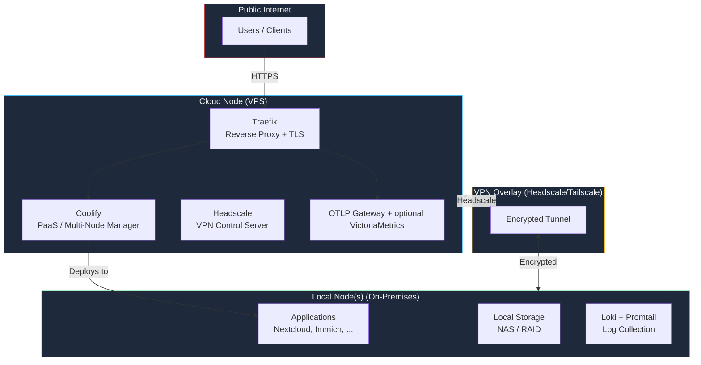
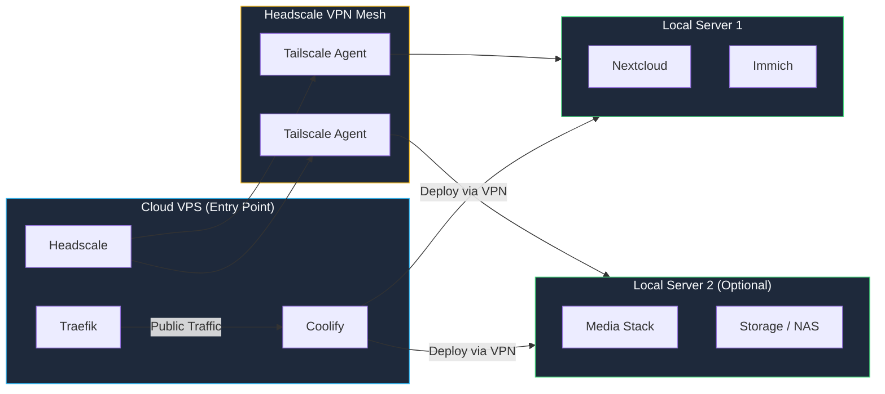
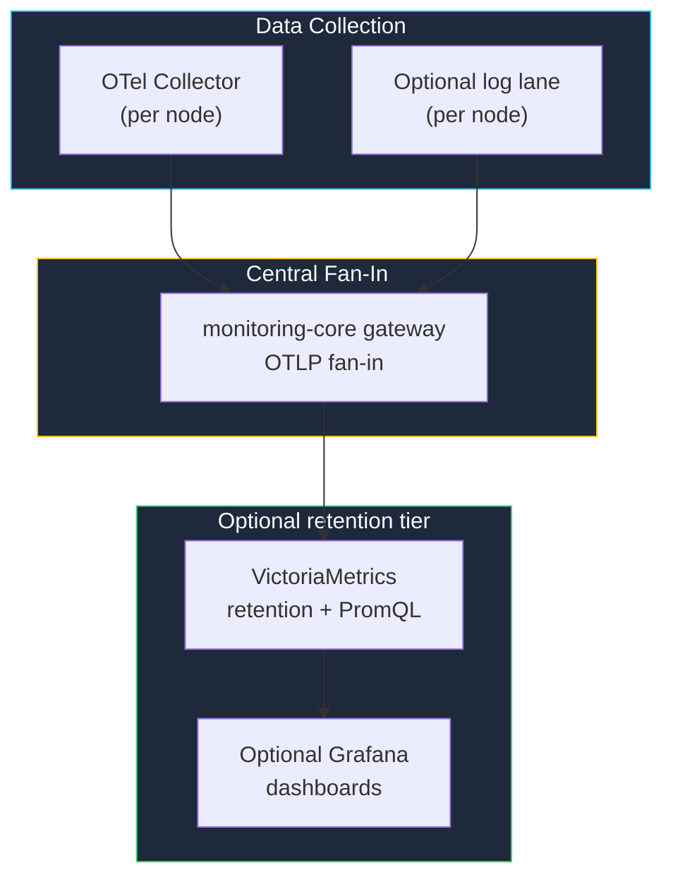

The **Modern Homelab Kit** resolves an explicit **Home-and-Cloud topology** in one StackKit: a local site anchored on your on-premises hardware and a cloud site that carries the public edge, connected over an encrypted VPN overlay.

Use it when a single-environment [Base Kit](/stackkits/kits/base-kit) does not fit — you need public-facing services on a VPS, applications and data staying at home, and the two halves governed as one stack.

<Note>
  Modern Homelab became functional in StackKits **v0.9.0** and now sits on the same standalone lifecycle as the Base Kit. If you only need a single-node baseline first, start with the [StackKits quickstart](/stackkits/quickstart) and the [Base Kit](/stackkits/kits/base-kit).
</Note>

## What v0.9.0 landed

The Modern Homelab Kit is not a schema stub anymore. As of v0.9.0 it is a first-class product kit built on the stable v0.8 standalone lifecycle, with these guarantees:

- **Explicit Home-and-Cloud topology.** The kit resolves a two-site plan — local (home) and cloud (VPS) — instead of overlaying hybrid roles on a single-environment kit.
- **Local Owner authority.** The Owner authority that signs off on Apply, Upgrade, Backup, Restore, and Drift stays local. Techstack and Kombify Cloud remain optional orchestrators; they never become local lifecycle or Owner authority.
- **Owner-specific federation projections.** Federation state is projected per Owner, so the cloud edge never sees the home Owner's authority material as its own.
- **Governed warm-standby placement, no separate HA Kit.** Warm-standby placement for critical services is a governed feature of Modern Homelab itself. There is no separate "HA Kit" to install to get resilient placement across the two sites.
- **Signed execution-channel bundles + digest-pinned process executor.** Advanced Day-2 and RIL (Remote Instruction Lane) operations run through signed execution-channel bundles executed by a digest-pinned process executor. The bundle signature and digest are the offline-verifiable boundary — you can verify what will run before it runs, without contacting a control plane.
- **Inventory carries no secrets and no transport.** The Inventory record carries neither credentials nor transport endpoints. Credentials and transport live in the execution channel, not in the plan.

### v0.9.1 storage-defaults fix

If you generated a `stackkit init modern-homelab` scaffold on v0.9.0 exactly, `stackkit validate` rejected its own output with:

```
resolvedPlan.storage.hostRoots.dataRoot: requires an absolute host storage root
```

That happened because `#StackSpecV2` defaulted `storage` to `{}`, and the empty default won over unifying with `#StorageIntentV2`. Both `cloud-kit` and `modern-homelab` shipped `storage: {}` and were affected; only `basement-kit`, which spells host roots out by hand, escaped.

**v0.9.1** materializes absolute host storage roots for every product kit. `stackkit validate` now accepts `stackkit init modern-homelab` output as-is. If you still see the error, upgrade the CLI — you are pinned to v0.9.0.

## Overview



## Key features

<CardGroup cols={3}>
  <Card title="Multi-Node Docker" icon="server">
    Deploy across cloud VPS and local servers
  </Card>
  <Card title="Coolify PaaS" icon="rocket">
    Professional deployment platform for multi-node setups
  </Card>
  <Card title="VPN Overlay" icon="lock">
    Headscale/Tailscale for secure inter-node communication
  </Card>
  <Card title="Full Observability" icon="chart-line">
    OTLP collector baseline with optional central gateway, retention, and dashboards
  </Card>
  <Card title="Automatic TLS" icon="shield">
    Let's Encrypt certificates via Traefik
  </Card>
  <Card title="Public Access" icon="globe">
    Services accessible from the internet by default
  </Card>
</CardGroup>

## Requirements

| Resource | Cloud Node (VPS) | Local Node | Total Minimum |
|----------|------------------|------------|---------------|
| **Nodes** | 1 VPS | 1+ local | 2+ |
| **CPU** | 2 cores | 4 cores | 6 cores |
| **RAM** | 4 GB | 8 GB | 12 GB |
| **Storage** | 50 GB SSD | 100 GB | 150 GB |
| **Network** | Public IPv4, 1 Gbps | LAN access | -- |

**Additional prerequisites:**
- Own domain with DNS control (e.g., Cloudflare, Hetzner DNS)
- DNS provider API access for automated TLS provisioning
- SSH access to all nodes

<Warning>
  The Modern Homelab Kit requires both cloud and local infrastructure. If you only need a single environment (local or cloud), use the [Base Kit](/stackkits/kits/base-kit) instead.
</Warning>

## Architecture deep dive

### Hybrid topology

The Modern Homelab Kit connects cloud and local infrastructure using a VPN overlay:



**Traffic flow:**
1. Public requests hit Traefik on the cloud VPS
2. Traefik routes to Coolify-managed applications
3. Applications on local nodes are reached via the Headscale VPN tunnel
4. Local nodes never expose ports to the public internet

### Observability stack



| Component | Purpose | Default Config |
|-----------|---------|----------------|
| OTel Collector | Metrics baseline | Per-node collector, OTLP export |
| monitoring-core gateway | Fan-in | Optional central OTLP gateway |
| VictoriaMetrics | Metrics retention | Optional backend for multi-node or longer retention |
| Grafana | Visualization | Optional dashboard surface when backend tier is enabled |
| Logs lane | Log forwarding | Opt-in; only enable when the deployment needs it |

## Quick start

<Steps>
  <Step title="Define your hybrid setup">
    ```yaml stack-spec.yaml
    stackkit: modern-homelab

    domain: homelab.example.com
    email: you@example.com

    nodes:
      - name: cloud-entry
        type: cloud
        provider:
          type: hetzner
          region: fsn1
          size: cx21
          image: debian-12

      - name: local-server
        type: local
        network:
          localIp: 192.168.1.100
          subnet: 192.168.1.0/24
    ```
  </Step>

  <Step title="Configure VPN overlay">
    ```yaml
    vpn:
      enabled: true
      provider: headscale
      magicDns: true
    ```
  </Step>

  <Step title="Enable services">
    ```yaml
    services:
      # Reverse proxy (cloud node)
      traefik:
        enabled: true
        acme: true
        acmeEmail: you@example.com

      # PaaS platform (cloud node)
      coolify:
        enabled: true

      # VPN control server (cloud node)
      headscale:
        enabled: true

    addons:
      - monitoring-core

    observability:
      monitoring:
        signals:
          metrics: true
          logs: true
        gateway:
          enabled: true
        backend:
          enabled: true
          grafana:
            enabled: true
    ```
  </Step>

  <Step title="Deploy infrastructure">
    ```bash
    stackkit validate
    stackkit generate
    stackkit deploy
    ```
  </Step>
</Steps>

## Configuration reference

### Node configuration

<Tabs>
  <Tab title="Cloud Node">
    ```yaml
    nodes:
      - name: cloud-entry
        type: cloud
        hostname: cloud-entry

        provider:
          type: hetzner        # hetzner, digitalocean, vultr, linode
          region: fsn1
          size: cx21           # 2 vCPU, 4 GB RAM
          image: debian-12

        docker:
          version: "24.0"
          dataRoot: /var/lib/docker

        ssh:
          user: root
          port: 22
    ```
  </Tab>
  <Tab title="Local Node">
    ```yaml
    nodes:
      - name: local-server
        type: local
        hostname: local-server

        provider:
          type: bare-metal

        network:
          localIp: 192.168.1.100
          subnet: 192.168.1.0/24

        docker:
          version: "24.0"
          dataRoot: /var/lib/docker

        labels:
          storage: "true"
          role: application
    ```
  </Tab>
</Tabs>

### VPN configuration

```yaml
vpn:
  enabled: true
  provider: headscale
  derpEnabled: true
  derpRegions:
    - default
  magicDns: true
```

The VPN overlay creates an encrypted mesh between all nodes. Headscale is the self-hosted Tailscale control server -- no third-party dependency required.

### Monitoring configuration

```yaml
observability:
  monitoring:
    signals:
      metrics: true
      logs: true
    collector:
      profile: full
    gateway:
      enabled: true
    backend:
      enabled: true
      retentionPeriod: 30d
      grafana:
        enabled: true
```

## Platform components

### Coolify -- Multi-node PaaS

Coolify manages deployments across your nodes. While the Base Kit defaults to Coolify for single-environment setups, the Modern Homelab Kit leverages its multi-node capabilities for hybrid topologies:

- Multi-node deployment via SSH
- Git-based deployments (push to deploy)
- Built-in database management
- Application monitoring and logs
- Resource limits per container

```yaml
coolify:
  autoUpdate: false
  pushEnabled: true
  instanceSettings:
    isRegistrationEnabled: false
    isAutoUpdateEnabled: false
  resources:
    cpuLimit: "2.0"
    memoryLimit: "2048m"
```

### Service placement

Services are placed on specific nodes based on their role:

| Service | Placement | Reason |
|---------|-----------|--------|
| Traefik | Cloud node | Public entry point, TLS termination |
| Coolify | Cloud node | Needs SSH access to all nodes |
| Headscale | Cloud node | VPN coordination server |
| Prometheus + Grafana | Cloud node | Accessible remotely |
| Applications | Local node(s) | Data stays on-premises |
| Storage/NAS | Local node(s) | Physical disk access |
| Promtail + Node Exporter | All nodes | Per-node monitoring agents |

## Adding more nodes

```yaml
# Add to stack-spec.yaml
nodes:
  # ... existing nodes

  - name: local-media
    type: local
    network:
      localIp: 192.168.1.101
      subnet: 192.168.1.0/24
    labels:
      role: media-server
```

```bash
stackkit deploy --node local-media
```

The new node is automatically joined to the Headscale VPN mesh and registered in Coolify.

## Security

### Network isolation

- Local nodes are **never** directly exposed to the internet
- All inter-node traffic is encrypted via Headscale VPN
- Traefik handles TLS termination for public services
- Coolify enforces resource limits per container

### Authentication

```yaml
auth:
  provider: pocketid      # PocketID for SSO
  twoFactor: true
  allowedDomains:
    - example.com
```

### Firewall rules

The StackKit configures firewall rules automatically:

| Port | Cloud Node | Local Node | Purpose |
|------|-----------|------------|---------|
| 22 | Open | LAN only | SSH access |
| 80 | Open | Closed | HTTP redirect |
| 443 | Open | Closed | HTTPS traffic |
| 41641 | Open | Open | Headscale/WireGuard |
| All others | Closed | Closed | -- |

## Comparison with other StackKits

| Feature | Base Kit | High Availability Kit | Modern Homelab Kit |
|---------|-------------|------------|----------------|
| **Nodes** | 1 | 2+ (local) | 2+ (cloud + local) |
| **Platform** | Docker + Coolify | Docker Swarm | Docker + Coolify |
| **Network** | Local only | Local LAN | VPN overlay (Headscale) |
| **Public Access** | Optional (Cloudflare Tunnel) | Optional | Default |
| **Monitoring** | OTLP collector baseline | OTLP collector + gateway planning | Collector baseline + monitoring-core |
| **Domain Required** | No | No | Yes |
| **Complexity** | Low | Medium | High |
| **Status** | v1.0 (production) | vision-only | v0.9 (functional; preview graduation pending) |

## Troubleshooting

<AccordionGroup>
  <Accordion title="VPN connection issues">
    1. Check Headscale status: `headscale nodes list`
    2. Verify Tailscale agent on local node: `tailscale status`
    3. Test connectivity: `tailscale ping <cloud-node>`
    4. Check firewall: ensure UDP port 41641 is open on both sides
  </Accordion>

  <Accordion title="Coolify cannot reach local node">
    1. Verify VPN tunnel is established
    2. Check SSH access via VPN IP: `ssh root@<tailscale-ip>`
    3. Ensure Docker is running on the target node
    4. Check Coolify server settings for the correct VPN IP
  </Accordion>

  <Accordion title="TLS certificate errors">
    1. Verify DNS records point to cloud node public IP
    2. Check Traefik ACME logs: `docker logs traefik`
    3. Ensure ports 80 and 443 are open on the cloud node
    4. Verify DNS provider API credentials in Traefik config
  </Accordion>

  <Accordion title="Monitoring gaps">
    1. Verify OTel Collector is running on all nodes
    2. Check the OTLP receiver or gateway endpoint is reachable over the VPN path
    3. Inspect TechStack `/api/v1/monitor/health` for ingest-lane and backend diagnostics
    4. If enabled, verify VictoriaMetrics and Grafana separately from the collector baseline
  </Accordion>
</AccordionGroup>

## Migration from the Base Kit

<Steps>
  <Step title="Backup all data">
    ```bash
    stackkit backup --all --output ./backup
    ```
  </Step>

  <Step title="Provision cloud node">
    Add a cloud node to your `stack-spec.yaml` and provision it:
    ```yaml
    stackkit: modern-homelab  # Changed from base-kit

    nodes:
      - name: cloud-entry
        type: cloud
        provider:
          type: hetzner
          region: fsn1
          size: cx21
          image: debian-12

      - name: local-server   # Your existing server
        type: local
        network:
          localIp: 192.168.1.100
    ```
  </Step>

  <Step title="Deploy hybrid infrastructure">
    ```bash
    stackkit generate
    stackkit deploy
    ```
  </Step>

  <Step title="Restore data on local node">
    ```bash
    stackkit restore --from ./backup --node local-server
    ```
  </Step>
</Steps>

## Next steps

<CardGroup cols={2}>
  <Card title="StackKits quickstart" icon="rocket" href="/stackkits/quickstart">
    Single-node baseline: install the CLI, run `stackkit init`, and validate.
  </Card>
  <Card title="Base Kit" icon="house" href="/stackkits/kits/base-kit">
    The single-environment blueprint to start from before adopting Home-and-Cloud.
  </Card>
  <Card title="Monitoring setup" icon="chart-line" href="/stackkits/reference/monitoring">
    Configure the OTLP collector baseline and optional retention tier.
  </Card>
  <Card title="Spec format" icon="file-code" href="/stackkits/reference/spec-format">
    Reference for `stack-spec.yaml`, including Home-and-Cloud fields.
  </Card>
</CardGroup>
