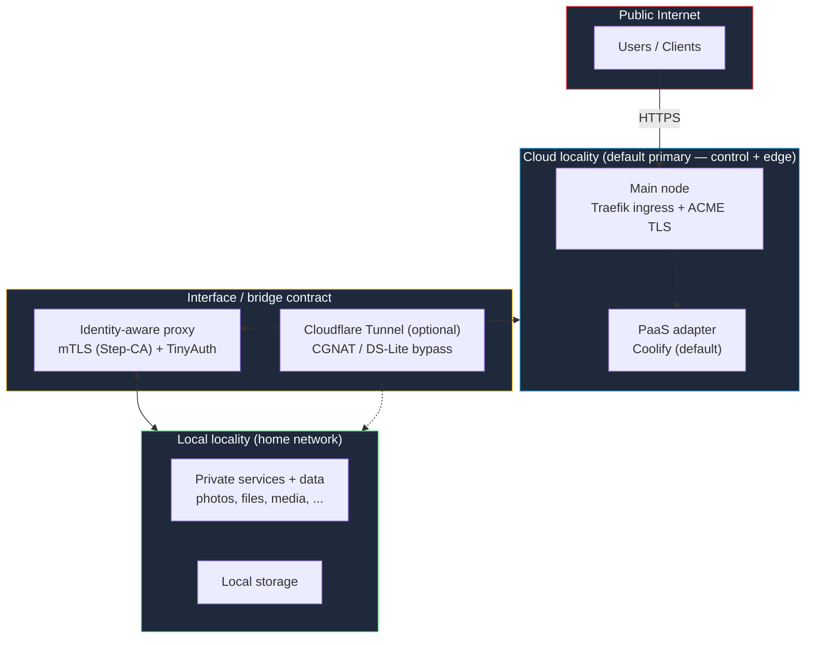

The **Modern Homelab** combines a local node-set and a cloud node-set into one homelab: public-facing services run at the cloud edge, private services and data stay at home, and an **interface/bridge contract** connects the two localities.

<Warning>
  **Early Access / Preview** — the Modern Homelab kit is alpha scaffolding today. It does not yet have a verified multi-node end-to-end gate, and its schema and defaults can still change. For production deployments today, use the [Basement Kit](https://docs.kombify.io/stackkits/kits/basement-kit).
</Warning>

## What makes a Modern Homelab

A Modern Homelab is the **union of a Basement node-set and a Cloud node-set, plus the bridge contract**. The minimum topology is two nodes: at least one local **and** at least one cloud node.

The defining piece is the bridge contract — not node count:

| Bridge contract element | What it does |
|-------------------------|--------------|
| **Identity-aware proxy** | mTLS between localities (private PKI via Step-CA) plus TinyAuth as the auth boundary — cross-locality traffic is authenticated, not just tunneled |
| **Cloudflare Tunnel (optional)** | Bypasses CGNAT / DS-Lite so local services stay reachable without opening home ports |
| **Cross-locality service placement** | Decides which services run at the cloud edge and which stay local |
| **Data-placement policy** | Declares which data may leave the local trust boundary |
| **Cross-node backup** | Backups span localities instead of living next to the data they protect |

By default, the **primary locality is cloud**: the control plane and public edge live on the cloud node. You can override this with explicit intent.

## Overview



## Multi-node alone is not Modern Homelab

Adding nodes to a kit does not change the kit. The kit boundaries are drawn by locality and the bridge contract:

| Topology | Kit |
|----------|-----|
| Several nodes, all local or Pi | [Basement Kit](https://docs.kombify.io/stackkits/kits/basement-kit) |
| Several nodes, all cloud | [Cloud Kit](https://docs.kombify.io/stackkits/kits/cloud-kit) |
| At least one local + one cloud node, joined by the bridge contract | **Modern Homelab** |

There is no silent in-between: a bare cross-locality worker join (say, one local main with a single cloud worker and no bridge contract) is **not** treated as "Basement with a remote node". The resolver either upgrades that topology to a Modern Homelab — with the bridge contract required — or rejects it with actionable guidance.

## Requirements

- **At least 2 nodes:** one local node (home hardware) and one cloud node (a VPS you bring, when self-hosting)
- A domain you control, with DNS access, for the public edge and TLS
- SSH access to every node

## Service placement

Cross-locality placement follows the control/edge-in-cloud default:

| Concern | Locality |
|---------|----------|
| Public entry, TLS termination | Cloud |
| Control plane (main node) | Cloud (default primary — overridable by explicit intent) |
| Private services and data | Local |
| Backups | Cross-node, spanning localities |

## PaaS adapter

| Adapter | Status |
|---------|--------|
| **Coolify** | Default |
| **Komodo** | Supported production alternative |
| **Dokploy** | Draft |

## Self-hosted vs managed

<Note>
  **The topology is open source.** You can build the full Modern Homelab yourself: bring your own VPS for the cloud half and wire the bridge manually. Nothing in the architecture is feature-gated.

  **Managed Modern Homelab** is the subscription option: kombify provisions the cloud half, sets up the bridge, and handles the lifecycle for you. You pay for the convenience — hosting, provisioning, lifecycle, and support — not for unlocked features.
</Note>

## Example spec (preview)

The spec below shows the intended shape. As a preview kit, field names and defaults may still change.

```yaml stack-spec.yaml
stackkit: modern-homelab

domain: homelab.example.com
email: you@example.com

nodes:
  - name: cloud-edge
    type: cloud          # default primary locality: control plane + public edge

  - name: home-server
    type: local          # private services and data
```

```bash
stackkit validate
```

## Next steps

<CardGroup cols={2}>
  <Card title="Basement Kit" icon="house" href="https://docs.kombify.io/stackkits/kits/basement-kit">
    The production-ready local kit — the recommended starting point today.
  </Card>
  <Card title="Cloud Kit" icon="cloud" href="https://docs.kombify.io/stackkits/kits/cloud-kit">
    The single-environment cloud sibling, without the hybrid bridge.
  </Card>
</CardGroup>
