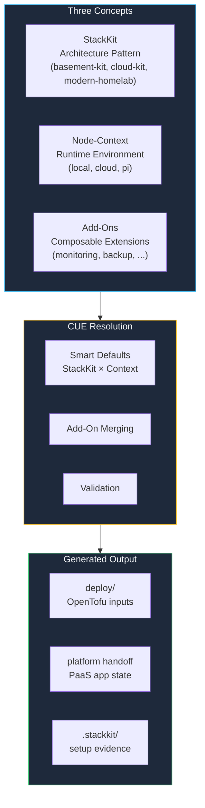
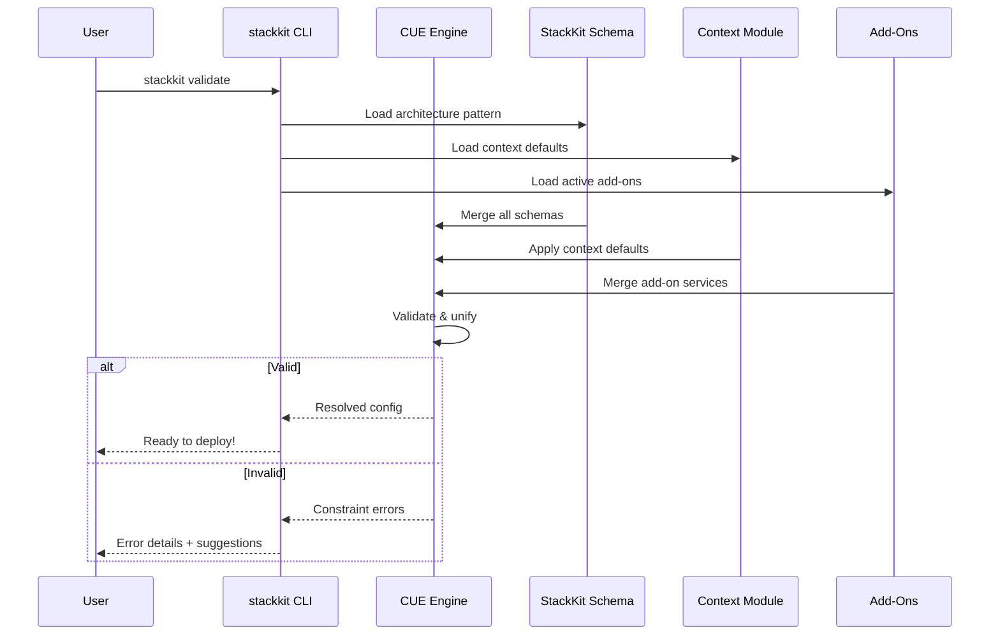

StackKits are validated, reusable infrastructure blueprints that define **architecture patterns** for your homelab. Each StackKit describes how services relate to each other — not how many servers you need.

## What is a StackKit?

A StackKit combines three concepts to produce your infrastructure:



A StackKit is a **smart configuration system** that:
1. **Validates** your choices against proven architecture patterns
2. **Detects** your runtime environment and applies context-aware defaults
3. **Merges** composable Add-Ons for additional capabilities
4. **Generates** release-packaged infrastructure artifacts and rollout evidence

## The problem StackKits solve

<Tabs>
  <Tab title="The challenge">
    You want to set up a homelab. You've heard of:
    - Traefik (or Caddy? or nginx?)
    - TinyAuth + PocketID (or Authentik? or Keycloak?)
    - Coolify (or Komodo? or another PaaS?)
    - Immich (or Photoprism?)

    **Questions that keep you stuck:**
    - Which tools work well together?
    - How do I configure them correctly?
    - What are the best practices?
    - How do I avoid security issues?
  </Tab>
  <Tab title="The solution">
    Pick a StackKit pattern, let context handle the rest:
    
    ```yaml stack-spec.yaml
    version: "2.0"
    stackkit: basement-kit
    domain: homelab.example.com

    addons:
      - monitoring
      - backup
    ```
    
    **StackKits provide:**
    - Curated service combinations
    - Context-aware defaults (local vs cloud vs Raspberry Pi)
    - Composable Add-Ons instead of monolithic configs
    - Validation before deployment
  </Tab>
</Tabs>

## Available StackKits

StackKits are **architecture patterns**, not node-count definitions. Basement Kit and Cloud Kit are the installable single-environment kits; Modern Homelab is Preview / Early Access.

<CardGroup cols={3}>
  <Card title="Basement Kit" icon="house" href="https://docs.kombify.io/stackkits/kits/basement-kit">
    **Local single-environment pattern**

    All services on your home network — one trust domain, one main node.

    - Contexts `local` and `pi`
    - Coolify default
    - Any node count
  </Card>

  <Card title="Cloud Kit" icon="cloud" href="https://docs.kombify.io/stackkits/kits/cloud-kit">
    **Cloud single-environment pattern**

    The same node model as Basement, on a VPS you bring.

    - Context `cloud`
    - Public ingress + Let's Encrypt
    - BYO-VPS
  </Card>

  <Card title="Modern Homelab" icon="link" href="https://docs.kombify.io/stackkits/kits/modern-homelab">
    **Hybrid infrastructure pattern**

    Bridges local and cloud environments through the bridge contract.

    - Preview / Early Access
    - ≥1 local + ≥1 cloud node
    - Public + private services
  </Card>
</CardGroup>

<Note>
  **High Availability is an add-on, not a kit.** Layer the [`ha` add-on](https://docs.kombify.io/stackkits/addons/high-availability) onto any kit — `warm-standby` (2+ nodes) or `quorum` (3+ odd manager nodes). The node floors are technical prerequisites, never paywalls.
</Note>

## The three concepts

### 1. StackKit = Architecture pattern

A StackKit defines **how services relate to each other**, not how many servers you have.

| StackKit | Pattern | Example |
|----------|---------|---------|
| **basement-kit** | Local single-environment | 1 Pi running all services, or 3 servers in your basement sharing the same stack |
| **cloud-kit** | Cloud single-environment | 1 VPS (or several cloud nodes) running the whole stack |
| **modern-homelab** | Hybrid (Preview) | Home server + cloud VPS joined by the bridge contract |

<Tip>
  A `basement-kit` or `cloud-kit` StackKit can run on multiple nodes in the same environment. Multi-node alone does not make a deployment a Modern Homelab — the bridge contract between local and cloud does.
</Tip>

### 2. Node-Context = auto-detected environment

Each node is automatically classified based on hardware and provider metadata:

| Context | Detection | Affects |
|---------|-----------|---------|
| **local** | Physical hardware, no cloud metadata | Self-signed TLS, local DNS, `*.home.localhost` |
| **cloud** | Cloud provider metadata detected | Let's Encrypt, Coolify PaaS, public DNS |
| **pi** | ARM + low memory or RPi detection | Reduced services, ARM images, tmpfs |

<Note>
  At Level 0 (standalone CLI), you specify context manually. At Level 2+ (with kombify TechStack agent), context is auto-detected from hardware reports.
</Note>

### 3. Add-Ons = composable extensions

Add-Ons replace the old monolithic variant system. They are stackable, declare their compatibility, and layer onto any kit. The catalog currently ships 18 add-ons:

| Category | Add-Ons |
|----------|---------|
| Observability & data | `monitoring`, `backup`, `backup-repo-server` |
| Apps & media | `media`, `photos`, `vault`, `file-sharing`, `calendar`, `mail`, `gameserver` |
| Compute & dev | `ai-workloads`, `dev-platform` |
| Identity & access | `authelia`, `remote-desktop` |
| Networking | `vpn-overlay`, `tunnel` |
| Reliability | [`ha`](https://docs.kombify.io/stackkits/addons/high-availability) (tiers: `warm-standby`, `quorum`) |
| Home | `smart-home` |

```yaml stack-spec.yaml
addons:
  - monitoring       # VictoriaMetrics + Grafana + Loki + Alloy
  - backup           # Kopia encrypted backups (3-2-1)
  - media            # Jellyfin + *arr stack
```

See the full per-add-on detail and the platform-service alternatives in [tool alternatives](https://docs.kombify.io/stackkits/reference/tool-alternatives). For the monitoring contract, see [/stackkits/reference/monitoring](https://docs.kombify.io/stackkits/reference/monitoring).

## Progressive capability model

StackKits operate at different capability levels depending on how you access them:

| Level | Name | Access Method | Capabilities |
|-------|------|---------------|-------------|
| **0** | Standalone CLI | `stackkit` CLI directly | CUE validation, IaC generation, direct provisioning |
| **1** | Control Plane | kombify TechStack Web UI/API | Unifier pipeline, wizard UI, StackKit resolver |
| **2** | Worker Agent | kombify TechStack + gRPC Agent | Context auto-detection, placement engine |
| **3** | Runtime Intelligence | Day-2 operations | Drift detection, auto-remediation, cert renewal |
| **4** | AI-Assisted (SaaS) | kombify Cloud | Natural language config, predictive scaling |

<Warning>
  Level 4 capabilities are available exclusively through kombify Cloud (SaaS) and require cloud connectivity.
</Warning>

## How StackKits work

### Context-driven defaults matrix

The combination of StackKit × Context produces curated default configurations:

| | local | cloud | pi |
|---|---|---|---|
| **basement-kit** | Coolify, local `.home.localhost` links | — | Lean profile, reduced services |
| **cloud-kit** | — | Coolify or Komodo, Let's Encrypt | — |
| **modern-homelab** | Preview | Preview | Preview |

### Validation flow

When you run `stackkit validate` or use kombify TechStack:



## StackKit comparison

| Feature | basement-kit | cloud-kit | modern-homelab |
|---------|------|--------|-----|
| **Pattern** | Local single-environment | Cloud single-environment | Hybrid (Preview / Early Access) |
| **Contexts** | `local`, `pi` | `cloud` | ≥1 local + ≥1 cloud |
| **Typical nodes** | 1 (supports N) | 1 (supports N) | 2+ (multi-environment) |
| **Complexity** | Low | Low | Medium |
| **Cross-environment link** | — | — | Bridge contract |
| **Failover** | Via the [`ha` add-on](https://docs.kombify.io/stackkits/addons/high-availability) | Via the [`ha` add-on](https://docs.kombify.io/stackkits/addons/high-availability) | Via the [`ha` add-on](https://docs.kombify.io/stackkits/addons/high-availability) |
| **Best for** | First homelab, home network | Single VPS, public services | Hybrid setups, local data + public reach |

## Choosing a StackKit

<AccordionGroup>
  <Accordion title="I'm new to homelabs" icon="seedling">
    **Use: basement-kit**
    
    Start simple with a local single-environment setup:
    - Easy to understand
    - Minimal resource requirements
    - Great for learning
    - Add capabilities later with Add-Ons
  </Accordion>

  <Accordion title="I want a cloud-only stack" icon="cloud">
    **Use: cloud-kit**
    
    The same single-environment model on a VPS you bring:
    - Public ingress by default
    - Let's Encrypt certificates
    - No hardware at home
  </Accordion>
  
  <Accordion title="I want local + cloud" icon="link">
    **Use: modern-homelab** (Preview / Early Access)
    
    For hybrid setups connecting different environments:
    - The bridge contract connects local and cloud nodes
    - Public services via cloud nodes
    - Private services stay local
  </Accordion>
  
  <Accordion title="I need high availability" icon="shield">
    **Use: the `ha` add-on** — HA is an add-on, not a kit
    
    When downtime is unacceptable, layer [High Availability](https://docs.kombify.io/stackkits/addons/high-availability) onto any kit:
    - `warm-standby`: continuous backup + automated restore to a standby node (2+ nodes; downtime = restore time)
    - `quorum`: etcd live failover (3+ odd manager nodes; near-zero downtime)
    - Node floors are technical prerequisites, never paywalls
  </Accordion>
</AccordionGroup>

## Next steps

<CardGroup cols={2}>
  <Card title="Basement Kit" icon="house" href="https://docs.kombify.io/stackkits/kits/basement-kit">
    Detailed documentation for the local single-environment StackKit
  </Card>
  <Card title="CUE language basics" icon="code" href="https://docs.kombify.io/stackkits/explanations/cue-architecture">
    Learn the CUE language used in StackKits
  </Card>
  <Card title="Customization guide" icon="sliders" href="https://docs.kombify.io/stackkits/explanations/cue-architecture">
    How to customize StackKits for your needs
  </Card>
  <Card title="Quick start" icon="rocket" href="https://docs.kombify.io/stackkits/quickstart">
    Deploy your first StackKit
  </Card>
</CardGroup>
