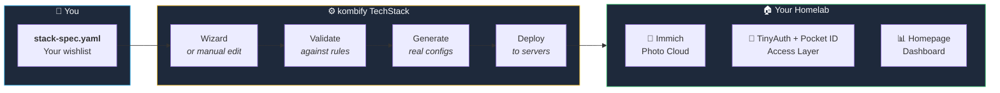
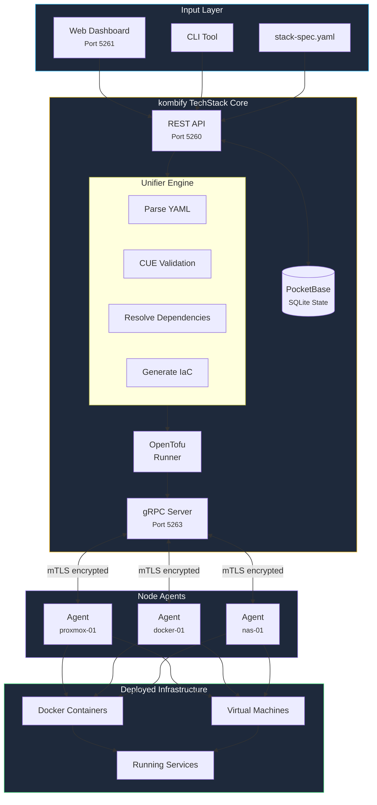
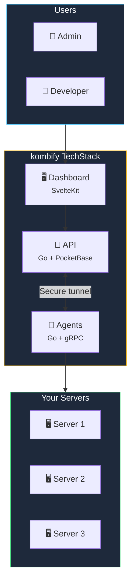
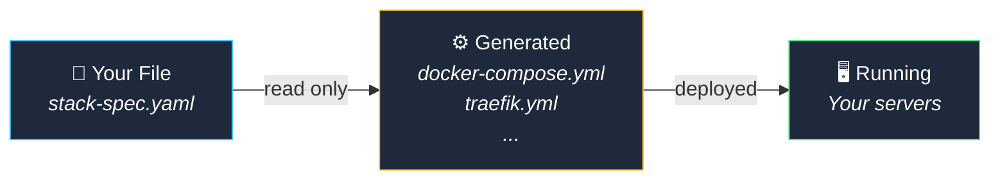
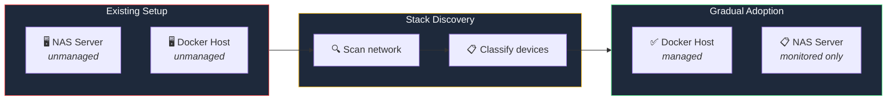

**kombify TechStack** is your homelab's control center. Tell it what you want, and it figures out how to make it happen — from a single server to a multi-node cluster.

## The simple version

<Card title="What does Stack do?" icon="lightbulb">
  Imagine you want a private photo cloud for your family. Instead of spending days researching Docker, reverse proxies, and SSL certificates, you write a simple configuration file describing *what* you want.

  Stack handles *everything else* — validation, setup, deployment, and ongoing maintenance.
</Card>

```yaml stack-spec.yaml
# This is all you write
stackkit: basement-kit
services:
  - traefik    # Handles web traffic
  - immich     # Your photo cloud
```

Stack transforms this into hundreds of lines of configuration and deploys it to your server automatically.

<Accordion title="🔧 Technical details" icon="code">
  Stack is a Go-based orchestration engine that:
  - Reads your `stack-spec.yaml` specification
  - Validates it against CUE schemas from StackKits
  - Generates OpenTofu/Docker configurations
  - Deploys via mTLS-secured gRPC agents on your nodes
  - Continuously monitors for drift between desired and actual state
  
  **Tech stack:** Go 1.25+, PocketBase (SQLite), OpenTofu, CUE, gRPC with mTLS
</Accordion>

## Key features

<CardGroup cols={2}>
  <Card title="Write once, deploy anywhere" icon="file-code">
    Your entire homelab configuration lives in one YAML file — version-controlled, shareable, reproducible
  </Card>
  <Card title="Test before you break things" icon="flask">
    Simulate deployments in Docker before touching real hardware
  </Card>
  <Card title="Works with what you have" icon="arrows-rotate">
    Already running servers? Stack discovers them and lets you adopt gradually
  </Card>
  <Card title="Self-healing" icon="shield-check">
    Detects when reality drifts from your configuration and can fix it automatically
  </Card>
  <Card title="Wallet-first access" icon="key">
    Daily access and recovery are split into `Tools`, `Access`, and `Recovery` so operators open services first and reveal credentials only when necessary
  </Card>
</CardGroup>

## How it works



<Steps>
  <Step title="Describe what you want" icon="wand-magic-sparkles">
    Use the Easy Wizard or write a simple YAML file — no need to understand Docker, networking, or certificates
  </Step>
  <Step title="Stack validates your choices" icon="check">
    Your configuration is checked against proven patterns to catch errors before deployment
  </Step>
  <Step title="Infrastructure code is generated" icon="code">
    Stack creates all the complex configuration files you'd otherwise write by hand
  </Step>
  <Step title="Services are deployed" icon="rocket">
    Lightweight agents on your servers apply the changes and report back
  </Step>
</Steps>

<Accordion title="🔧 Under the hood: The complete data flow" icon="diagram-project">



**Data flow explained:**
1. **Input** — Configuration enters via Web UI, CLI, or direct YAML file
2. **Unifier Engine** — Parses, validates against CUE schemas, resolves dependencies, generates OpenTofu code
3. **State Management** — PocketBase stores stack state, job history, and agent registry
4. **Agent Communication** — gRPC with mutual TLS ensures secure, authenticated communication
5. **Deployment** — Agents execute changes on their respective nodes

</Accordion>

## Architecture at a glance



### Ports and services

| Service | Port | What it does |
|---------|------|--------------|
| **Dashboard** | 5261 | Web interface for managing your homelab |
| **API** | 5260 | REST API + PocketBase admin panel |
| **gRPC** | 5263 | Secure communication with agents |

<Accordion title="🔧 Technical specifications" icon="microchip">

| Component | Technology | Purpose |
|-----------|------------|---------|
| **Backend** | Go 1.25+ | Core services, agents, CLI |
| **Frontend** | SvelteKit 2.x | Modern reactive dashboard |
| **Database** | PocketBase (SQLite) | Embedded state management |
| **IaC Engine** | OpenTofu 1.6+ | Infrastructure provisioning |
| **Validation** | CUE 0.15+ | Type-safe schema validation |
| **Networking** | gRPC + mTLS | Encrypted agent communication |

**Why these choices?**
- **Go** — Single binary, low memory, cross-platform
- **PocketBase** — Zero-config embedded database with auth
- **OpenTofu** — Open-source Infrastructure as Code engine, battle-tested
- **CUE** — Catch configuration errors before deployment
- **mTLS** — Every connection is encrypted and authenticated

</Accordion>

## Core principles

### 1. Your intent stays untouched



kombify TechStack never modifies your configuration file. All transformations create separate artifacts that you can inspect.

### 2. One Stack = one homelab

<Note>
  A single kombify TechStack instance manages one homelab. That homelab can include multiple physical servers (nodes), but they belong to one logical unit.
</Note>

Need multiple homelabs? Use [kombify Cloud](/cloud/overview) to manage several Stack instances from one dashboard.

### 3. Brownfield-friendly

Already have servers running? kombify TechStack doesn't force you to start from scratch:



- **Managed** — Stack fully controls configuration and deployment
- **Unmanaged** — Stack sees the device but doesn't touch it
- You can gradually move devices from unmanaged to managed as you're ready

## Quick Example

```yaml stack-spec.yaml
version: "1.0"
stackkit: basement-kit

meta:
  name: my-homelab
  domain: home.example.com

nodes:
  - name: proxmox-01
    type: hypervisor
    connection:
      host: 192.168.1.100
      user: root
      ssh_key: ~/.ssh/id_ed25519

services:
  - traefik      # Reverse proxy with auto-SSL
  - tinyauth     # Access gateway
  - homepage     # Dashboard
  - immich       # Photo management
```

```bash
# Validate configuration
kombify validate

# Preview changes
kombify plan

# Apply to infrastructure
kombify apply
```

## Self-Hosting

<Card title="Self-Hosting Guide" icon="server" href="/techstack/how-to/self-hosting">
  Self-hosting is planned — the OSS distribution is not yet published. Preview the intended Docker Compose flow.
</Card>

## Next Steps

<Columns cols={2}>
  <Card title="Quick Start" icon="rocket" href="/techstack/quickstart">
    Deploy your first stack in 10 minutes
  </Card>
  <Card title="Architecture Deep Dive" icon="sitemap" href="/techstack/explanations/architecture">
    Understand the Unifier, agents, and data flow
  </Card>
</Columns>

---

## Getting Help

<Columns cols={3}>
  <Card title="Troubleshooting" icon="wrench" href="/techstack/reference/troubleshooting">
    Common issues and solutions
  </Card>
  <Card title="Discord" icon="discord" href="https://discord.gg/kombify">
    Real-time community support
  </Card>
  <Card title="GitHub" icon="github" href="https://github.com/kombifyio/techstack">
    Report issues and contribute
  </Card>
</Columns>
